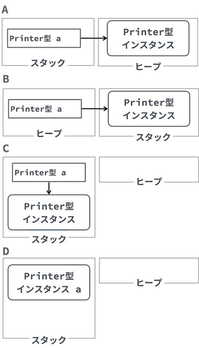
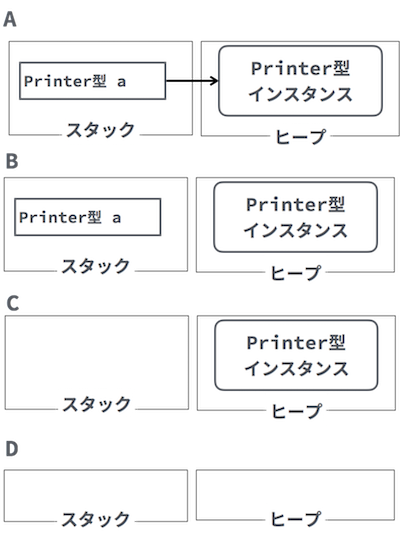
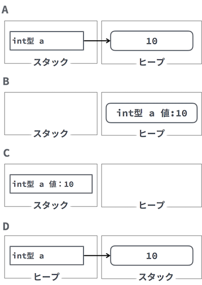
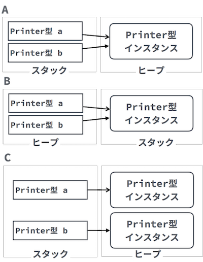

# クラス構造　Lv2

----

### 教材制作者へ

特に指示の無い場合は**入力問題**とする。

----

## Q1

部品となるクラス「Printer」を利用するプログラムとなるよう、空欄を埋めよ。

```java
public static void main(String[] args) {
  [  1  ]  [  2  ];
}
```

###ヒント1

プログラムを部品に分けるためには、実行用のクラスとは別のクラスを作る。

部品用のクラスを使うためには、クラスの内容をメモリ上に用意する「インスタンス化」を行う。

###ヒント2

インスタンス化には、new 演算子を用いる。

###ヒント3

例えば、Fooクラスがあったときは、 new Foo(); のように記述する。

```java
class Foo {
  // 部品クラス
}
```

```java
// Fooクラスをインスタンス化する
new Foo();
```

答え

1. new
2. Printer();


## Q2

部品となるクラス「Inputter」を利用するプログラムとなるよう、空欄を埋めよ。

```java
public static void main(String[] args) {
  [  1  ]  [  2  ];
}
```

###ヒント1

プログラムを部品に分けるためには、実行用のクラスとは別のクラスを作る。

部品用のクラスを使うためには、クラスの内容をメモリ上に用意する「インスタンス化」を行う。

###ヒント2

インスタンス化には、new 演算子を用いる。

###ヒント3

例えば、Fooクラスがあったときは、 new Foo(); のように記述する。

```java
class Foo {
  // 部品クラス
}
```

```java
// Fooクラスをインスタンス化する
new Foo();
```

答え

1. new
2. Inputter();

## Q3

Printerクラスをインスタンス化し、その機能であるprint()メソッドを利用するプログラムになるよう、空欄を埋めよ。

```java
public static void main(String[] args) {
  [  1  ] p = [  2  ] Printer();
  [  3  ].print();
}
```

###ヒント1

プログラムを部品に分けるためには、実行用のクラスとは別のクラスを作る。

部品用のクラスを使うためには、クラスの内容をメモリ上に用意する「インスタンス化」を行う。

インスタンス化には、new 演算子を用いる。

###ヒント2

例えば、Fooクラスがあったときは、 new Foo(); のように記述する。

```java
class Foo {
  // 部品クラス
}
```

```java
// Fooクラスをインスタンス化する
new Foo();
```

###ヒント3

部品クラスのインスタンスのデータ（フィールド）や機能（メソッド）を利用するためには、インスタンスを変数から参照できるようにする。

インスタンスを変数から参照する場合は、クラス名を型として変数を宣言する。

```java
// Fooクラス型の変数fが、Fooクラスのインスタンスを参照する
Foo f = new Foo();
// fに参照されたFooインスタンスのrun()メソッドを利用する
f.run();
```

答え

1. Printer
2. new
3. p

## Q4

Inputterクラスをインスタンス化し、その機能であるinput()メソッドを利用するプログラムになるよう、空欄を埋めよ。

```java
public static void main(String[] args) {
  Inputter inp = [  1  ] [  2  ];
  inp.[  3  ];
}
```

###ヒント1

プログラムを部品に分けるためには、実行用のクラスとは別のクラスを作る。

部品用のクラスを使うためには、クラスの内容をメモリ上に用意する「インスタンス化」を行う。

インスタンス化には、new 演算子を用いる。

###ヒント2

例えば、Fooクラスがあったときは、 new Foo(); のように記述する。

```java
class Foo {
  // 部品クラス
}
```

```java
// Fooクラスをインスタンス化する
new Foo();
```

###ヒント3

部品クラスのインスタンスのデータ（フィールド）や機能（メソッド）を利用するためには、インスタンスを変数から参照できるようにする。

インスタンスを変数から参照する場合は、クラス名を型として変数を宣言する。

```java
// Fooクラス型の変数fが、Fooクラスのインスタンスを参照する
Foo f = new Foo();
// fに参照されたFooインスタンスのrun()メソッドを利用する
f.run();
```

答え

1. new
2. Inputter()
3. input


## Q5

次のプログラムの実行直後の、JVMのメモリ領域を表す概要図として、最も正しいものはどれか。

```
Printer a = new Printer();
```



こたえ [    ]


### ヒント1

部品用のクラスを使うためには、クラスの内容をメモリ上に用意する「インスタンス化」を行う。

インスタンス化には、new 演算子を用いる。

インスタンスを変数から参照する場合は、クラス名を型とした参照型変数を宣言する。

```
// Fooクラス型の変数fが、Fooクラスのインスタンスを参照する
Foo f = new Foo();
```

### ヒント2

JVMでは、インスタンスは、ヒープ領域に用意される。

### ヒント3

参照型変数はスタック領域に用意され、ヒープ領域を参照するための情報が格納される。

これらの関係を正しく表している図は A である。

答え A


## Q6

次のプログラムの実行直後の、JVMのメモリ領域を表す概要図として、最も正しいものはどれか。

```
Printer a = new Printer();
a = null;
```



こたえ [    ]

### ヒント1

部品用のクラスを使うためには、クラスの内容をメモリ上に用意する「インスタンス化」を行う。

インスタンス化には、new 演算子を用いる。

インスタンスを変数から参照する場合は、クラス名を型とした参照型変数を宣言する。

```
// Fooクラス型の変数fが、Fooクラスのインスタンスを参照する
Foo f = new Foo();
```

### ヒント2

JVMでは、インスタンスは、ヒープ領域に用意される。

参照型変数はスタック領域に用意され、ヒープ領域を参照するための情報が格納される。

### ヒント3

nullは、参照するものがないことを示す。

これらの関係を正しく表している図は B である。

答え B


## Q7

次のプログラムの実行直後の、JVMのメモリ領域を表す概要図として、最も正しいものはどれか。

```
int a = 10;
```



### ヒント1

部品用のクラスを使うためには、クラスの内容をメモリ上に用意する「インスタンス化」を行う。

インスタンス化には、new 演算子を用いる。

インスタンスを変数から参照する場合は、クラス名を型とした参照型変数を宣言する。

```
// Fooクラス型の変数fが、Fooクラスのインスタンスを参照する
Foo f = new Foo();
```

### ヒント2

JVMでは、インスタンスは、ヒープ領域に用意される。

参照型変数はスタック領域に用意され、ヒープ領域を参照するための情報が格納される。

### ヒント3

プリミティブ型の変数は、スタック領域の変数に直接格納される。

これらの関係を正しく表している図は C　である。

答え C


## Q8

次のプログラムの実行直後の、JVMのメモリ領域を表す概要図として、最も正しいものはどれか。

```
Printer a = new Printer();
Printer b = a;
```


答え [    ]

### ヒント1

部品用のクラスを使うためには、クラスの内容をメモリ上に用意する「インスタンス化」を行う。

インスタンス化には、new 演算子を用いる。

インスタンスを変数から参照する場合は、クラス名を型とした参照型変数を宣言する。

```
// Fooクラス型の変数fが、Fooクラスのインスタンスを参照する
Foo f = new Foo();
```

### ヒント2

JVMでは、インスタンスは、ヒープ領域に用意される。

参照型変数はスタック領域に用意され、ヒープ領域を参照するための情報が格納される。

### ヒント3

プリミティブ型の変数は、スタック領域の変数に直接格納される。

参照型の変数の代入は、インスタンスの場所を代入することになる。

これらの関係を正しく表している図は A である。

答え A
