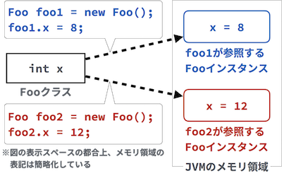
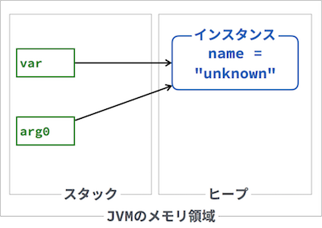
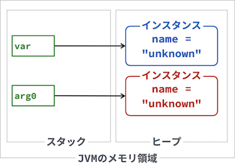

# クラス構造　Lv6

----

### 教材制作者へ

特に指示の無い場合は**入力問題**とする。

----

## Q1

----

### 教材制作者へ

回答欄7〜9は選択式にしてください。選択肢：不明, 合格, 不合格

----

実行結果が表示されるプログラムになるよう、空欄を埋めなさい。

```java
class Main {
  public static void main(String[] args) {
    Person p1 = [ 1 ] [ 2 ]("Taro", 19);
    Person p2 = [ 1 ] [ 2 ]("Hanako", 20);
    System.out.println(p1.isAdult());
    System.out.println(p2.isAdult());
  }
}

class Person {
  String name;
  int age;

  [ 3 ]([ 4 ] arg0, [ 5 ] arg1) {
    name = arg0;
    age = arg1;
  }

  String isAdult() {
    if ([ 6 ] < 20) {
      return [ 7 ] + "さんは未成年";
    } else {
      return [ 8 ] + "さんは未年";
    }
  }
}
```

```
実行結果
Taroさんは未成年
Hanakoさんは成年
```

### ヒント1

あるクラスからインスタンス化を行うことで、メモリ上には異なるインスタンスが作成される。

インスタンスごとに、異なるデータ（つまり、フィールドの値）を持つことができる。



### ヒント2

インスタンスでは、メソッドやコンストラクタからそれぞれのフィールドの値を利用できる。

```java
class Hoge {
  String x;

  void doSomething() {
    // メソッドの処理にフィールドを利用できる。
    // フィールドの値が異なる場合は、メソッドの実行結果も異なる。
    System.out.println(x);
  }
}
```

### ヒント3

コンストラクタ引数を用いると、クラスをインスタンス化する際に、フィールドの値を引数で初期化できる。

```java
class Hoge {
  int x;

  Hoge(int arg0) {
    x = arg0
  }
}
```

```java
// Hoge.xを10にしてインスタンス化する
Hoge hoge = new Hoge(10);
```

答え

1. new
2. Person
3. Person
4. String
5. int
6. age
7. name
8. name

## Q2

実行結果が表示されるプログラムになるよう、空欄を埋めなさい。

```java
class Main {
  public static void main(String[] args) {
    Sum obj = [ 1 ] [ 2 ](4, 8);
    System.out.println(obj.[ 3 ] + "たす"
      + obj.[ 4 ] + "は" + obj.[ 5 ]);
  }
}

class Sum {
  int x;
  int y;

  [ 6 ]([ 7 ] arg0, [ 8 ] arg1) {
    x = arg0;
    y = arg1;
  }

  int getX() {
    return x;
  }

  int getY() {
    return y;
  }

  int sum() {
    return x + y;
  }
}
```

```
実行結果
4たす8は12
```

### ヒント1

クラスのインスタンス化には、new演算子を利用する。

```java
// Hogeクラスをインスタンス化し、hoge変数が参照する
Hoge hoge = new Hoge();
```

### ヒント2

インスタンスのフィールドやメソッドは、ピリオドを用いて利用できる

```java
// hoge変数が参照するインスタンスのfooフィールドの値を利用する
hoge.foo;

// hoge変数が参照するインスタンスのbarメソッドを利用する
hoge.bar();
```

### ヒント3

コンストラクタ引数を用いると、クラスをインスタンス化する際に、フィールドの値を引数で初期化できる。

```java
class Hoge {
  int x;

  Hoge(int arg0) {
    x = arg0
  }
}
```

```java
// Hoge.xを10にしてインスタンス化する
Hoge hoge = new Hoge(10);
```


答え

1. new
2. Sum
3. getX()
4. getY()
5. sum()
6. Sum
7. int
8. int


## Q3

次のプログラムを実行した場合の、実行結果を答えよ。

```java
class Main {

  public static void main(String[] args) {
    Person person = new Person("unknown");

    Converter converter = new Converter();

    converter.toDo1(person);
    person.print();

    converter.toDo2(person);
    person.print();

    converter.toDo3(person);
    person.print();
  }

}

class Converter {

  void toDo1(Person arg0) {
    arg0.setName("taro");
  }

  void toDo2(Person arg0) {
    arg0.name = "hanako";
  }

  void toDo3(Person arg0) {
    arg0 = new Person("hikari");
  }
  
}

class Person {

  String name;

  Person(String arg0) {
    name = arg0;
  }

  void setName(String arg0) {
    name = arg0;
  }

  void print() {
    System.out.println(name);
  }
  
}
```

```
実行結果
[ 1 ]
[ 2 ]
[ 3 ]
```

### ヒント1

コンストラクタ引数を用いると、クラスをインスタンス化する際に、フィールドの値を引数で初期化できる。

```java
class Hoge {
  int x;

  Hoge(int arg0) {
    x = arg0
  }
}
```

```java
// Hoge.xを10にしてインスタンス化する
Hoge hoge = new Hoge(10);
```


### ヒント2

引数 arg0 に、参照型変数 var が渡される場合は、図のように、var、arg0は同じインスタンスを参照している。



つまり、var.name が変更されることは、arg0.name が変更されることと同じになる。（設問では、ConverterクラスのtoDo1, toDo2メソッドがこれにあてはまる）


### ヒント3

一方で、引数 arg1 に新しいインスタンスがインスタンス化されると、図ののように、var、arg0は異なるインスタンスを参照することになる。



つまり、arg0.name が変更されても、varインスタンスには影響がない。（設問では、ConverterクラスのtoDo3メソッドがこれにあてはまる）


答え

1. Taro
2. Hanako
3. Hanako

## Q4

次のプログラムを実行した場合の、実行結果を答えよ。

```java
class Main {

  public static void main(String[] args) {
    String[] strs = new String[3];
    Converter converter = new Converter();
    converter.toDo1(strs);
    converter.toDo2(strs);
    converter.toDo3(strs);

    for (String str : strs) {
      System.out.println(str);
    }
  }

}

class Converter {

  void toDo1(String[] arg0) {
    String a = "taro";
    arg0 = new String[]{a};
  }

  void toDo2(String[] arg1) {
    String b = "hanako";
    arg1[1] = b;
  }

  void toDo3(String[] arg2) {
    String[] arg3 = arg2;
    String c = "hikari";
    arg3[2] = c;
  
  }
}
```

```
実行結果
null
hanako
hikari
```

### ヒント1

Stringは参照型である。

参照型の変数や配列要素が、インスタンスを参照していないことを表す特別な記号を null と呼ぶ。

nullの変数や配列要素を標準出力で表示すると、特別に null という文字列が表示される。


### ヒント2

引数 arg0 に、参照型変数 var が渡される場合は、図のように、var、arg0は同じインスタンスを参照している。


つまり、var.name が変更されることは、arg0.name が変更されることと同じになる。（設問では、ConverterクラスのtoDo2, toDo3メソッドがこれにあてはまる）

### ヒント3

一方で、引数 arg1 に新しいインスタンスがインスタンス化されると、図ののように、var、arg0は異なるインスタンスを参照することになる。


つまり、arg0.name が変更されても、varインスタンスには影響がない。（設問では、ConverterクラスのtoDo1メソッドがこれにあてはまる）


答え

1. null
2. Hanako
3. Hikari

## Q5

----

### 教材制作者へ

回答欄は選択式にしてください。

- コンパイルできないため、実行できない
- 実行するとエラーが発生する
- HelloとGood byeとThank youが1行ずつ表示される
- HelloとGood byeとThank youが1行にまとめて表示される
- ["Hello", "Good bye", Thank "you"] と表示される
- strs変数が参照するインスタンスのハッシュコードが表示される
- 何も表示されない

----

次のプログラムを実行した場合の、実行結果を選べ。

```java
class Main {
  public static void main(String[] args) {
    String[] strs = {"Hello", "Good Bye", "Thank you"};
    Printer printer = new Printer();
    printer.print();
  }
}

class Printer {
  String[] strs;

  Printer() {
    strs = null;
  }

  Printer(String[] arg0) {
    this.strs = arg0;
  }

  void print() {
    for (String str : strs) {
      System.out.println(str);
    }
  }
}
```

### ヒント1

参照型の変数や配列要素が、インスタンスを参照していないことを表す特別な記号を null と呼ぶ。

### ヒント2

コンストラクタ引数を用いると、クラスをインスタンス化する際に、フィールドの値を引数で初期化できる。

```java
class Hoge {
  int x;

  Hoge(int arg0) {
    x = arg0
  }
}
```

```java
// Hoge.xを10にしてインスタンス化する
Hoge hoge = new Hoge(10);
```

### ヒント3

引数のあるコンストラクタに対して、標準のコンストラクタをデフォルトコンストラクタと呼ぶ。

設問のプログラムのmainメソッドでは、デフォルトコンストラクタのみ使って、Printerクラスをインスタンス化している。

このため、printer変数が参照するインスタンスのstrs配列は、nullである。

nullな配列から要素を取り出すことはできないため、プログラムを実行すると、下のfor文の1行目でエラーが生じる。

```
for (String str : strs) {
  System.out.println(str);
}
```

答え

実行するとエラーが発生する

## Q6

----

### 教材制作者へ

回答欄は選択式にしてください。

- コンパイルできないため、実行できない
- 実行するとエラーが発生する
- HelloとGood byeとThank youが1行ずつ表示される
- HelloとGood byeとThank youが1行にまとめて表示される
- ["Hello", "Good bye", Thank "you"] と表示される
- strs変数が参照するインスタンスのハッシュコードが表示される
- 何も表示されない

----

次のプログラムを実行した場合の、実行結果を選べ。

```java
class Main {
  public static void main(String[] args) {
    String[] strs = {"Hello", "Good Bye", "Thank you"};
    Printer printer = new Printer(strs);
    printer.print();
  }
}

class Printer {
  String[] strs;

  Printer() {
    strs = null;
  }

  Printer(String[] arg0) {
    this.strs = arg0;
  }

  void print() {
    for (String str : strs) {
      System.out.println(str);
    }
  }
}
```

### ヒント1

参照型の変数や配列要素が、インスタンスを参照していないことを表す特別な記号を null と呼ぶ。

### ヒント2

コンストラクタ引数を用いると、クラスをインスタンス化する際に、フィールドの値を引数で初期化できる。

```java
class Hoge {
  int x;

  Hoge(int arg0) {
    x = arg0
  }
}
```

```java
// Hoge.xを10にしてインスタンス化する
Hoge hoge = new Hoge(10);
```

### ヒント3

引数のあるコンストラクタに対して、標準のコンストラクタをデフォルトコンストラクタと呼ぶ。

設問のプログラムのmainメソッドでは、引数のあるコンストラクタを使って、Printerクラスをインスタンス化している。

このため、printer変数が参照するインスタンスのstrs配列と、呼び出し元のstrs配列は同じインスタンスを参照する。

プログラムを実行すると、strs配列の要素を1行ずつ表示する。

答え

HelloとGood byeとThank youが1行ずつ表示される

## Q7

プログラムが正常に動作するように空欄を埋め、実行結果を答えなさい。

ただし、String型のlengthメソッドは、文字列の長さ（文字数）を返すものである。

```java
class Main {
  public static void main(String[] args) {
    String[] strs = {"Hello", "Good Bye", "Thank you"};
    Printer printer = new [ 1 ];
    printer.print();
  }
}

class Printer {
  String[] strs;

  [ 2 ] {
    strs = null;
  }

  [ 3 ]([ 4 ] arg0) {
    this.strs = arg0;
  }

  void print() {
    for (String str : [ 5 ]) {
      int num = str.length();
      System.out.println(num);
    }
  }
}
```

```
実行結果
[ 6 ]
[ 7 ]
[ 8 ]
```

### ヒント1

参照型の変数や配列要素が、インスタンスを参照していないことを表す特別な記号を null と呼ぶ。

### ヒント2

コンストラクタ引数を用いると、クラスをインスタンス化する際に、フィールドの値を引数で初期化できる。

```java
class Hoge {
  int x;

  Hoge(int arg0) {
    x = arg0
  }
}
```

```java
// Hoge.xを10にしてインスタンス化する
Hoge hoge = new Hoge(10);
```

### ヒント3

引数 arg0 に、参照型変数 var が渡される場合は、図のように、var、arg0は同じインスタンスを参照している。


答え

1. Printer(Strs)
2. Printer
3. Printer
4. String[]
5. strs
6. 5
7. 8
8. 9

## Q8

数字を5回入力すると、実行結果の様に表示するプログラムになるよう、空欄を埋めなさい。

```java
static class Main {
  public static void main(String[] args) {
    int length = 5;
    Appender appender = new [ 1 ];
    Scanner keyInput = new Scanner(System.in);
    for (int i = 0; i < length; i++) {
      int input = keyInput.[ 2 ];
      appender.[ 3 ];
    }
    keyInput.close();
    System.out.println("入力された数は：");
    appender.[ 4 ];
  }
}

class Appender {
  int[] nums;

  [ 5 ](int length) {
    nums = new int[length];
  }

  void append([ 6 ] index, [ 7 ] input) {
    [ 8 ] = input;
  }

  void print() {
    for (int item : nums) {
      System.out.print(item + " ");
    }
  }
}
```

```
実行結果
8
9
1
3
4
入力された数は：
8 9 1 3 4 
```

### ヒント1

Javaで標準入力を利用する場合には、Scannerインスタンス と System.in を使う。

```java
// 整数を入力する
Scanner keyInput = new Scanner(System.in);
int x = keyInput.nextInt();
keyInput.close();
```

### ヒント2

インスタンスでは、メソッドやコンストラクタからそれぞれのフィールドの値を利用できる。

```java
class Hoge {
  String x;

  void doSomething() {
    // メソッドの処理にフィールドを利用できる。
    // フィールドの値が異なる場合は、メソッドの実行結果も異なる。
    System.out.println(x);
  }
}
```

### ヒント3

コンストラクタ引数を用いると、クラスをインスタンス化する際に、フィールドの値を引数で初期化できる。

```java
class Hoge {
  int x;

  Hoge(int arg0) {
    x = arg0
  }
}
```

```java
// Hoge.xを10にしてインスタンス化する
Hoge hoge = new Hoge(10);
```

答え

1. Appender(length)
2. nextInt()
3. append(i, input)
4. print()
5. Appender
6. int
7. int
8. nums[index]
