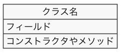
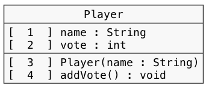

# クラス設計　Lv4

----

### 教材制作者へ

特に指示の無い場合は**リスト形式（一問一答）**とする。

----

## Q1

プログラムを表すクラス図になるよう、空欄を埋めなさい。

```java
class Gakuseki {

  String bangou;

  boolean setBangou(String bangou) {
   // 処理は省略...
  }

}
```


### 選択肢

#### 全て

- String
- Gakuseki
- bangou
- boolean
- setBangou
- true

## ヒント1

クラス図では、クラス名、インターフェース名、フィールド名とその型、メソッド名とその引数・戻り値の型、コンストラクタとその引数、クラスやインターフェース間の関係などが記載される。

## ヒント2

クラス図では、クラスの構造のうち、クラス名、フィールド、メソッド（コンストラクタ）が枠内に記載される。



## ヒント3

フィールドは

変数名 : 型

の形で記載される。

メソッドや引数、戻り値の型は、

メソッド名（引数 : 引数の型） : 戻り値の型

の形で記載される。

答え

1. Gakuseki
2. bangou
3. setBangou

## Q2

プログラムを表すクラス図になるよう、空欄を埋めなさい。

```java
class Gakuseki {

  String bangou;

  boolean setBangou(String bangou) {
   // 処理は省略...
  }

}
```


### 選択肢

#### 全て

- String
- Gakuseki
- bangou
- boolean
- int
- true

## ヒント1

クラス図では、クラス名、インターフェース名、フィールド名とその型、メソッド名とその引数・戻り値の型、コンストラクタとその引数、クラスやインターフェース間の関係などが記載される。

## ヒント2

クラス図では、クラスの構造のうち、クラス名、フィールド、メソッド（コンストラクタ）が枠内に記載される。


## ヒント3

フィールドは

変数名 : 型

の形で記載される。

メソッドや引数、戻り値の型は、

メソッド名（引数 : 引数の型） : 戻り値の型

の形で記載される。

答え

1. String
2. bangou
3. String
4. boolean

## Q3

クラス図を表すプログラムになるよう、空欄を埋めなさい。

```java
class [ 1 ] {

  String [ 2 ];

  boolean [ 3 ] (String bangou) {
   // 処理は省略...
  }

}
```


### 選択肢

#### 全て

- String
- Gakuseki
- bangou
- boolean
- setBangou
- true

## ヒント1

クラス図では、クラス名、インターフェース名、フィールド名とその型、メソッド名とその引数・戻り値の型、コンストラクタとその引数、クラスやインターフェース間の関係などが記載される。

## ヒント2

クラス図では、クラスの構造のうち、クラス名、フィールド、メソッド（コンストラクタ）が枠内に記載される。


## ヒント3

フィールドは

変数名 : 型

の形で記載される。

メソッドや引数、戻り値の型は、

メソッド名（引数 : 引数の型） : 戻り値の型

の形で記載される。

答え

1. Gakuseki
2. bangou
3. setBangou

## Q4

クラス図を表すプログラムになるよう、空欄を埋めなさい。

```java
class Gakuseki {

  [ 1 ] bangou;

  [ 2 ] setBangou([ 3 ] [ 4 ]) {
   // 処理は省略...
  }

}
```


### 選択肢

#### 全て

- String
- Gakuseki
- bangou
- boolean
- setBangou
- true

## ヒント1

クラス図では、クラス名、インターフェース名、フィールド名とその型、メソッド名とその引数・戻り値の型、コンストラクタとその引数、クラスやインターフェース間の関係などが記載される。

## ヒント2

クラス図では、クラスの構造のうち、クラス名、フィールド、メソッド（コンストラクタ）が枠内に記載される。


## ヒント3

フィールドは

変数名 : 型

の形で記載される。

メソッドや引数、戻り値の型は、

メソッド名（引数 : 引数の型） : 戻り値の型

の形で記載される。

答え

1. String
2. boolean
3. String
4. bangou


## Q5

プログラムを表すクラス図になるよう、空欄を埋めなさい。

```java
public class Player {

  private String name;
  private int vode;

  public  Player() {
    // 処理は省略
  }

  public void addVote() {
    // 処理は省略
  }

}
```



### 選択肢

#### 1〜4

- \-
- \+
- \~
- \#

### ヒント1

クラス図では、クラス名、インターフェース名、フィールド名とその型、メソッド名とその引数・戻り値の型、コンストラクタとその引数、クラスやインターフェース間の関係などが記載される。

### ヒント2

フィールドやメソッドの前にアクセス修飾子を記述することにより、フィールドやメソッドが他のプログラムからどのようにアクセスできるかを示すことができる。

### ヒント3

アクセス修飾子は、クラス図の中で記号で表される。

- \- private
- \+ public
- \~ package private（アクセス修飾子なし）
- \# protected

答え

1. \-
2. \-
3. \+
4. \+

## Q6

プログラムを表すクラス図になるよう、空欄を埋めなさい。

```java
public class Player {

  protected String name;
  protected int vode;

  Player() {
    // 処理は省略
  }

  void addVote() {
    // 処理は省略
  }

}
```


### 選択肢

#### 1〜4

- \-
- \+
- \~
- \#

### ヒント1

クラス図では、クラス名、インターフェース名、フィールド名とその型、メソッド名とその引数・戻り値の型、コンストラクタとその引数、クラスやインターフェース間の関係などが記載される。

### ヒント2

フィールドやメソッドの前にアクセス修飾子を記述することにより、フィールドやメソッドが他のプログラムからどのようにアクセスできるかを示すことができる。

### ヒント3

アクセス修飾子は、クラス図の中で記号で表される。

- \- private
- \+ public
- \~ package private（アクセス修飾子なし）
- \# protected

答え

1. \#
2. \#
3. \~
4. \~


## Q7

クラス図が表すプログラムになるよう、空欄を埋めなさい。

```java
public class Player {

  [  1  ] String name;
  [  2  ] int vode;

  [  3  ] Player() {
    // 処理は省略
  }

  [  4  ] void addVote() {
    // 処理は省略
  }

}
```


### 選択肢

#### 1〜4

- private
- public
- protected
- (記載なし)

### ヒント1

クラス図では、クラス名、インターフェース名、フィールド名とその型、メソッド名とその引数・戻り値の型、コンストラクタとその引数、クラスやインターフェース間の関係などが記載される。

### ヒント2

フィールドやメソッドの前にアクセス修飾子を記述することにより、フィールドやメソッドが他のプログラムからどのようにアクセスできるかを示すことができる。

### ヒント3

アクセス修飾子は、クラス図の中で記号で表される。

- \- private
- \+ public
- \~ package private（アクセス修飾子なし）
- \# protected

答え

1. private
2. private
3. public
4. public


## Q8

クラス図が表すプログラムになるよう、空欄を埋めなさい。

```java
public class Player {

  [  1  ] String name;
  [  2  ] int vode;

  [  3  ] Player() {
    // 処理は省略
  }

  [  4  ] void addVote() {
    // 処理は省略
  }

}
```


### 選択肢

#### 1〜4

- private
- public
- protected
- (記載なし)

### ヒント1

クラス図では、クラス名、インターフェース名、フィールド名とその型、メソッド名とその引数・戻り値の型、コンストラクタとその引数、クラスやインターフェース間の関係などが記載される。

### ヒント2

フィールドやメソッドの前にアクセス修飾子を記述することにより、フィールドやメソッドが他のプログラムからどのようにアクセスできるかを示すことができる。

### ヒント3

アクセス修飾子は、クラス図の中で記号で表される。

- \- private
- \+ public
- \~ package private（アクセス修飾子なし）
- \# protected

答え

1. protected
2. protected
3. (記載なし)
4. (記載なし)


