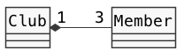
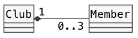
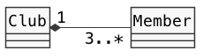
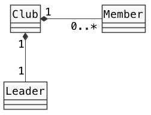
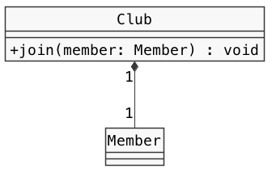
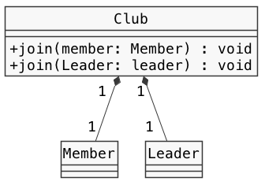
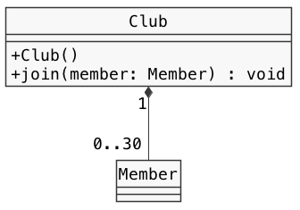
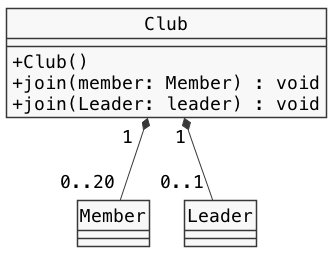

# クラス設計　Lv5

----

### 教材制作者へ

特に指示の無い場合は**リスト形式（一問一答）**とする。

----

## Q1

部活管理プログラムを作りたい。

部活と部員のクラスの関係を表したクラス図の説明について、当てはまるものを選べ。

- 部活 は 部員 を [  1  ] している。
- 部活 ひとつに対し、部員 は [  2  ] である。



### 選択肢

#### 1

- 継承
- 実装
- コンポジション
- 関連

#### 2

- 0〜3名まで
- 1〜3名まで
- 必ず3名
- 3名以上


### ヒント1

クラス図の黒塗りひし形の矢印は、クラスのコンポジションを表す。

### ヒント2

コンポジションは、あるクラスのインスタンスが、他のクラスのインスタンスをいくつか含んでいることを表す（has-a関係）。

つまり、フィールドの変数や配列がこれにあたる。

矢印の元のクラスのインスタンスが、矢印の先のクラスのインスタンスに含まれる。


### ヒント3

多重度は、インスタンスがいくつ含まれるかを示す数字と記号である。

例）

- A 1 ♦-- 1 B　の場合、Aひとつが、Bを必ずひとつ含む（1:1）
- A 1 ♦-- 2 B　の場合、Aひとつが、Bを必ずふたつ含む（1:2）
- A 1 ♦-- 0..3 の場合、Aひとつが、Bを0〜3個まで含むことができる（1:多）
- A 1 ♦-- 1..* の場合、Aひとつが、Bを1つ以上含むことができる（1:多）


答え

1. コンポジション
2. 必ず3名


## Q2

部活管理プログラムを作りたい。

部活と部員のクラスの関係を表したクラス図の説明について、当てはまるものを選べ。

- 部活 は 部員 を [  1  ] している。
- 部活 ひとつに対し、部員 は [  2  ] である。



### 選択肢

#### 1

- 継承
- 実装
- コンポジション
- 関連

#### 2

- 0〜3名まで
- 1〜3名まで
- 必ず3名
- 3名以上


### ヒント1

クラス図の黒塗りひし形の矢印は、クラスのコンポジションを表す。

### ヒント2

コンポジションは、あるクラスのインスタンスが、他のクラスのインスタンスをいくつか含んでいることを表す（has-a関係）。

つまり、フィールドの変数や配列がこれにあたる。

矢印の元のクラスのインスタンスが、矢印の先のクラスのインスタンスに含まれる。


### ヒント3

多重度は、インスタンスがいくつ含まれるかを示す数字と記号である。

例）

- A 1 ♦-- 1 B　の場合、Aひとつが、Bを必ずひとつ含む（1:1）
- A 1 ♦-- 2 B　の場合、Aひとつが、Bを必ずふたつ含む（1:2）
- A 1 ♦-- 0..3 の場合、Aひとつが、Bを0〜3個まで含むことができる（1:多）
- A 1 ♦-- 1..* の場合、Aひとつが、Bを1つ以上含むことができる（1:多）


答え

1. コンポジション
2. 0〜3名まで


## Q3

部活管理プログラムを作りたい。

部活と部員のクラスの関係を表したクラス図の説明について、当てはまるものを選べ。

- 部活 は 部員 を [  1  ] している。
- 部活 ひとつに対し、部員 は [  2  ] である。



### 選択肢

#### 1

- 継承
- 実装
- コンポジション
- 関連

#### 2

- 0〜3名まで
- 1〜3名まで
- 必ず3名
- 3名以上


### ヒント1

クラス図の黒塗りひし形の矢印は、クラスのコンポジションを表す。

### ヒント2

コンポジションは、あるクラスのインスタンスが、他のクラスのインスタンスをいくつか含んでいることを表す（has-a関係）。

つまり、フィールドの変数や配列がこれにあたる。

矢印の元のクラスのインスタンスが、矢印の先のクラスのインスタンスに含まれる。


### ヒント3

多重度は、インスタンスがいくつ含まれるかを示す数字と記号である。

例）

- A 1 ♦-- 1 B　の場合、Aひとつが、Bを必ずひとつ含む（1:1）
- A 1 ♦-- 2 B　の場合、Aひとつが、Bを必ずふたつ含む（1:2）
- A 1 ♦-- 0..3 の場合、Aひとつが、Bを0〜3個まで含むことができる（1:多）
- A 1 ♦-- 1..* の場合、Aひとつが、Bを1つ以上含むことができる（1:多）


答え

1. コンポジション
2. 3名以上


## Q4

部活管理プログラムを作りたい。

部活と部員のクラスの関係を表したクラス図の説明について、当てはまるものを選べ。

- 部活 は 部員 を [  1  ] している。
- 部活 ひとつに対し、部長 は [  2  ]
- 部活 ひとつに対し、部員 は [  3  ] である。



### 選択肢

#### 1

- 継承
- 実装
- コンポジション
- 関連

#### 2

- 0〜1名まで
- 1名以上
- 必ず1名
- 0名以上


### ヒント1

クラス図の黒塗りひし形の矢印は、クラスのコンポジションを表す。

### ヒント2

コンポジションは、あるクラスのインスタンスが、他のクラスのインスタンスをいくつか含んでいることを表す（has-a関係）。

つまり、フィールドの変数や配列がこれにあたる。

矢印の元のクラスのインスタンスが、矢印の先のクラスのインスタンスに含まれる。


### ヒント3

多重度は、インスタンスがいくつ含まれるかを示す数字と記号である。

例）

- A 1 ♦-- 1 B　の場合、Aひとつが、Bを必ずひとつ含む（1:1）
- A 1 ♦-- 2 B　の場合、Aひとつが、Bを必ずふたつ含む（1:2）
- A 1 ♦-- 0..3 の場合、Aひとつが、Bを0〜3個まで含むことができる（1:多）
- A 1 ♦-- 1..* の場合、Aひとつが、Bを1つ以上含むことができる（1:多）


答え

1. コンポジション
2. 必ず1名
3. 0名以上


## Q5 入力形式

部活と部員のクラスの関係を表したクラス図をもとにプログラムを作成する。

Clubクラスの空欄を埋めなさい。

```java
public class Club {

  private [  1  ] member;

  public void [  2  ](Member member) {
    // 処理は省略している
  }
}
```



### ヒント1

クラス図の黒塗りひし形の矢印は、クラスのコンポジションを表す。

### ヒント2

コンポジションは、あるクラスのインスタンスが、他のクラスのインスタンスをいくつか含んでいることを表す（has-a関係）。

つまり、フィールドの変数や配列がこれにあたる。

矢印の元のクラスのインスタンスが、矢印の先のクラスのインスタンスに含まれる。

### ヒント3

Clubひとつに対して、Memberは必ずひとつである。

つまり、ClubクラスのフィールドにはMemberクラスの変数がひとつあればよい。

答え

1. Member
2. join

## Q6 入力形式

部活と部員のクラスの関係を表したクラス図をもとにプログラムを作成する。

Clubクラスの空欄を埋めなさい。

```java
public class Club {

  private [  1  ] member;
  private [  2  ] leader;

  public void join(Member member) {
    // 処理は省略している
  }

  public void join(Leader laeder) {
    // 処理は省略している
  }

}
```



### ヒント1

クラス図の黒塗りひし形の矢印は、クラスのコンポジションを表す。

### ヒント2

コンポジションは、あるクラスのインスタンスが、他のクラスのインスタンスをいくつか含んでいることを表す（has-a関係）。

つまり、フィールドの変数や配列がこれにあたる。

矢印の元のクラスのインスタンスが、矢印の先のクラスのインスタンスに含まれる。

### ヒント3

Clubひとつに対して、Memberは必ずひとつである。

Clubひとつに対して、Leaderは必ずひとつである。

つまり、ClubクラスのフィールドにはMemberクラス、Leaderクラスの変数がひとつずつあればよい。

答え

1. Member
2. Leader

## Q7 入力形式

部活と部員のクラスの関係を表したクラス図をもとにプログラムを作成する。

Clubクラスの空欄を埋めなさい。

```java
public class Club {

  private [  1  ] members;

  public Club() {
    members = new [  2  ];
  }

  public void join(Member member) {
    // 処理は省略している
  }
}
```



### ヒント1

クラス図の黒塗りひし形の矢印は、クラスのコンポジションを表す。

### ヒント2

コンポジションは、あるクラスのインスタンスが、他のクラスのインスタンスをいくつか含んでいることを表す（has-a関係）。

つまり、フィールドの変数や配列がこれにあたる。

矢印の元のクラスのインスタンスが、矢印の先のクラスのインスタンスに含まれる。

### ヒント3

Clubひとつに対して、Memberは0以上30以下である。

つまり、ClubクラスのフィールドにはMember型の、長さ30の配列があればよい。

答え

1. Member[]
2. Member[30]

## Q8 入力形式

部活と部員のクラスの関係を表したクラス図をもとにプログラムを作成する。

Clubクラスの空欄を埋めなさい。

```java
public class Club {

  private [  1  ] leader;
  private [  2  ] members;

  public Club() {
    members = new [  3  ];
  }

  public void join(Leader leader) {
    // 処理は省略している
  }

  public void join(Member member) {
    // 処理は省略している
  }
}
```



### ヒント1

クラス図の黒塗りひし形の矢印は、クラスのコンポジションを表す。

### ヒント2

コンポジションは、あるクラスのインスタンスが、他のクラスのインスタンスをいくつか含んでいることを表す（has-a関係）。

つまり、フィールドの変数や配列がこれにあたる。

矢印の元のクラスのインスタンスが、矢印の先のクラスのインスタンスに含まれる。

### ヒント3

Clubひとつに対して、Leaderは0以上1以下である。

Clubひとつに対して、Memberは0以上20以下である。

つまり、Clubクラスのフィールドには、Leader型の変数と、Member型の、長さ30の配列があればよい。

答え

1. Leader
2. Member[]
3. Member[20]

