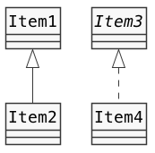
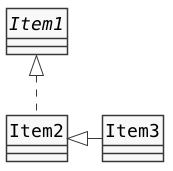

# クラス設計　Lv6

----

### 教材制作者へ

特に指示の無い場合は**リスト形式（一問一答）**とする。

----

## Q1

クラス図の説明について、当てはまるものを選べ。

- Item2 は Item1 を [ 1 ] している。
- Item4 は Item3 を [ 2 ] している。
- Item2 は Item1 の [ 3 ] である。
- Item1 は Item2 の [ 4 ] である。
- Item4 は Item3 の [ 5 ] である。
- Item3 は Item4 の [ 6 ] である。



### 選択肢

#### 1,2

- 継承
- 実装
- コンポジション
- 関連

#### 3〜4

- スーパークラス
- サブクラス
- 実装クラス
- インターフェース


### ヒント1

クラス図の白抜き矢印は、クラスの継承や実装を表す。

### ヒント2

白抜き実線の矢印は、クラスの継承を表す。

BクラスがAクラスを継承する場合、Bをサブクラス、Aをスーパークラスと呼ぶ。

サブクラスが矢印の根元、スーパークラスが矢印の先となる。

### ヒント3

白抜き点線の矢印は、クラスの実装を表す。

BクラスがAインターフェースを実装する場合、Bを実装クラスと呼ぶ。

実装クラスが矢印の根元、インターフェースが矢印の先となる。

答え

1. 継承
2. 実装
3. サブクラス
4. スーパークラス
5. 実装クラス
6. インターフェース


## Q2

クラス図の説明について、当てはまるものを選べ。

- Item2 は Item1 を [ 1 ] している。
- Item4 は Item3 を [ 2 ] している。
- Item1 は Item2 の [ 3 ] である。
- Item2 は Item1 の [ 4 ] である。
- Item3 は Item4 の [ 5 ] である。
- Item4 は Item3 の [ 6 ] である。


### 選択肢

#### 1,2

- 継承
- 実装
- コンポジション
- 関連

#### 3〜4

- スーパークラス
- サブクラス
- 実装クラス
- インターフェース


### ヒント1

クラス図の白抜き矢印は、クラスの継承や実装を表す。

### ヒント2

白抜き実線の矢印は、クラスの継承を表す。

BクラスがAクラスを継承する場合、Bをサブクラス、Aをスーパークラスと呼ぶ。

サブクラスが矢印の根元、スーパークラスが矢印の先となる。

### ヒント3

白抜き点線の矢印は、クラスの実装を表す。

BクラスがAインターフェースを実装する場合、Bを実装クラスと呼ぶ。

実装クラスが矢印の根元、インターフェースが矢印の先となる。

答え

1. 継承
2. 実装
3. スーパークラス
4. サブクラス
5. インターフェース
6. 実装クラス


## Q3

クラス図の説明について、当てはまるものを選べ。

- Item2 は Item1 を [ 1 ] している。
- Item3 は Item2 を [ 2 ] している。
- Item1 は Item2 の [ 3 ] である。
- Item2 は Item1 の [ 4 ] である。
- Item2 は Item3 の [ 5 ] である。
- Item3 は Item2 の [ 6 ] である。



### 選択肢

#### 1,2

- 継承
- 実装
- コンポジション
- 関連

#### 3〜4

- スーパークラス
- サブクラス
- 実装クラス
- インターフェース


### ヒント1

クラス図の白抜き矢印は、クラスの継承や実装を表す。

### ヒント2

白抜き実線の矢印は、クラスの継承を表す。

BクラスがAクラスを継承する場合、Bをサブクラス、Aをスーパークラスと呼ぶ。

サブクラスが矢印の根元、スーパークラスが矢印の先となる。

### ヒント3

白抜き点線の矢印は、クラスの実装を表す。

BクラスがAインターフェースを実装する場合、Bを実装クラスと呼ぶ。

実装クラスが矢印の根元、インターフェースが矢印の先となる。

答え

1. 実装
2. 継承
3. インターフェース
4. 実装クラス
5. スーパークラス
6. サブクラス


## Q4

クラス図の説明について、当てはまるものを選べ。

- Item2 は Item1 を [ 1 ] している。
- Item3 は Item2 を [ 2 ] している。
- Item2 は Item1 の [ 3 ] である。
- Item1 は Item2 の [ 4 ] である。
- Item3 は Item2 の [ 5 ] である。
- Item2 は Item3 の [ 6 ] である。


### 選択肢

#### 1,2

- 継承
- 実装
- コンポジション
- 関連

#### 3〜4

- スーパークラス
- サブクラス
- 実装クラス
- インターフェース


### ヒント1

クラス図の白抜き矢印は、クラスの継承や実装を表す。

### ヒント2

白抜き実線の矢印は、クラスの継承を表す。

BクラスがAクラスを継承する場合、Bをサブクラス、Aをスーパークラスと呼ぶ。

サブクラスが矢印の根元、スーパークラスが矢印の先となる。

### ヒント3

白抜き点線の矢印は、クラスの実装を表す。

BクラスがAインターフェースを実装する場合、Bを実装クラスと呼ぶ。

実装クラスが矢印の根元、インターフェースが矢印の先となる。

答え

1. 実装
2. 継承
3. 実装クラス
4. インターフェース
5. サブクラス
6. スーパークラス


# Q5

次のプログラムがコンパイルできるように、空欄を埋めなさい。

```
public interface Item1 {

  public void say()

}

public class Item2 [  1  ] Item1 {

  [  2  ]
  public [  3  ] [  4  ] {
    // 処理は省略
  }

}
```

### 選択肢

#### すべて

- @Override
- class
- implements
- exntends
- say()
- void
- Item2()
- Item1()


### ヒント1

インターフェースは、クラスに必要なメソッドを宣言できるものである。

Aインターフェースは

```
interface A {
  // 実装クラスが持つメソッドの返値、メソッド名、引数
}
```

の様に定義する。

### ヒント2

インターフェースの宣言に従うクラスのことを、実装クラスと呼ぶ。

BクラスがAインターフェースを実装しているとき、 class B implements A と書く。

### ヒント3

インターフェースで宣言されたメソッドは、実装クラスにも作る必要がある。
これをオーバーライドという。

答え

1. implements
2. @Override
3. void
4. say()


# Q6

次のプログラムがコンパイルできるように、空欄を埋めなさい。

```
public [  1  ] Item1 {

  public void say()

}

public class Item2 implements Item1 {

  [  2  ]
  public [  3  ] [  4  ] {
    // 処理は省略
  }

}

```

### 選択肢

#### すべて

- @Override
- class
- implements
- exntends
- say()
- void
- Item2()
- Item1()


### ヒント1

インターフェースは、クラスに必要なメソッドを宣言できるものである。

Aインターフェースは

```
interface A {
  // 実装クラスが持つメソッドの返値、メソッド名、引数
}
```

の様に宣言する。

### ヒント2

インターフェースの宣言に従うクラスのことを、実装クラスと呼ぶ。

BクラスがAインターフェースを実装しているとき、 class B implements A と書く。

### ヒント3

インターフェースで宣言されたメソッドは、実装クラスにも作る必要がある。
これをオーバーライドという。


答え

1. interface
2. @Override
3. void
4. say()


## Q7

Item2 クラスのcall()メソッドを呼び出すと、実行結果が表示されるようにプログラムの空欄を埋めなさい。


```
public [  1  ] Item1 {
  [  2  ] String name;
  public void say() {
    System.out.println("My name is " + name);
  }
}

public class Item2 extends Item1 {

  public void call() {
    [  3  ] = "Hikari";
    [  4  ];
  }
}
```

```
実行結果
My name is Hikari
```

### 選択肢

#### すべて

- @Override
- class
- implements
- exntends
- say()
- name
- protected
- private

### ヒント1

継承は、あるクラスを元にした別のクラスを作ることである。

継承元となるクラスをスーパークラス、継承先となるクラスをサブクラスと呼ぶ。

### ヒント2

BクラスがAクラスを継承したサブクラスのとき、 class B extends A と書く。

### ヒント3

サブクラスでは、スーパークラスでアクセスが許可されている、
public, protected, package privateのフィールドやメソッドを利用することができる。

答え

1. class
2. protected
3. name
4. say()


## Q7

Item2 クラスのcall()メソッドを呼び出すと、実行結果が表示されるようにプログラムの空欄を埋めなさい。


```
public class Item1 {

  [  1  ] String name;

  [  2  ] void say() {
    System.out.println("My name is " + name);
  }

}

public class Item2 extends Item1 {

  public void call() {
    [  3  ] = "Hikari";
    [  4  ];
  }

}
```

```
実行結果
My name is Hikari
```

### 選択肢

#### すべて

- call()
- class
- implements
- exntends
- say()
- name
- protected
- private

### ヒント1

継承は、あるクラスを元にした別のクラスを作ることである。

継承元となるクラスをスーパークラス、継承先となるクラスをサブクラスと呼ぶ。

### ヒント2

BクラスがAクラスを継承したサブクラスのとき、 class B extends A と書く。

### ヒント3

サブクラスでは、スーパークラスでアクセスが許可されている、
public, protected, package privateのフィールドやメソッドを利用することができる。

答え

1. protected
2. protected
3. name
4. say()


## Q8

Item2 クラスのcall()メソッドを呼び出すと、実行結果が表示されるようにプログラムの空欄を埋めなさい。


```
public class Item1 {

  [  1  ] String name;

  [  2  ] void say() {
    System.out.println("My name is " + name);
  }

}

public class Item2 [  3  ] [  4  ] {

  public void call() {
    name = "Hikari";
    say();
  }

}
```

```
実行結果
My name is Hikari
```

### 選択肢

#### すべて

- Item1
- Item2
- implements
- exntends
- interface
- name
- protected
- private

### ヒント1

継承は、あるクラスを元にした別のクラスを作ることである。

継承元となるクラスをスーパークラス、継承先となるクラスをサブクラスと呼ぶ。

### ヒント2

BクラスがAクラスを継承したサブクラスのとき、 class B extends A と書く。

### ヒント3

サブクラスでは、スーパークラスでアクセスが許可されている、
public, protected, package privateのフィールドやメソッドを利用することができる。

答え

1. protected
2. protected
3. extends
4. Item1
