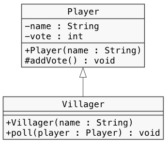
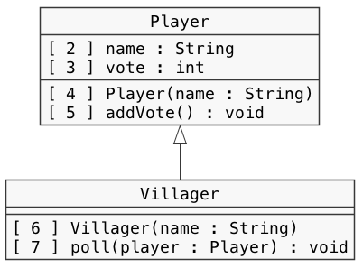
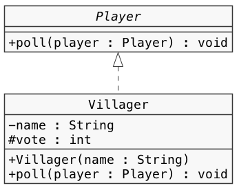
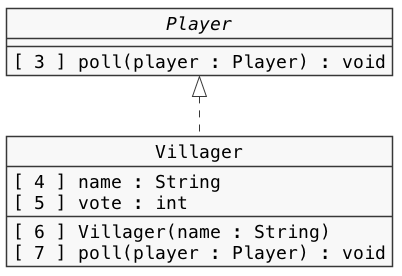

# クラス設計　Lv7

----

### 教材制作者へ

特に指示の無い場合は**リスト形式（一問一答）**とする。

----

## Q1

クラス図に示されたプログラムになるよう、空欄を埋めなさい。

ただし、メソッドなどの処理内容は省略している。

```java
public class Player {

  [  1  ] String name;
  [  2  ] int vote;

  public Player(String name) {
    // 略
  }

  [  3  ] void addVote() {
    // 略
  }

}

public class [  4  ] [  5  ] [  6  ] {

  public Villager(String name) {
    // 略
  }

  public void poll(Player player) {
    // 略
  }

}
```



### 選択肢

#### 1〜7すべて

- private
- public
- protected
- extends
- implements
- Player
- Villager
- Override

### ヒント1

クラス図では、クラス名、インターフェース名、フィールド名とその型、メソッド名とその引数・戻り値の型、コンストラクタとその引数、クラスやインターフェース間の関係などが記載される。

フィールド名やメソッド名の記号は、アクセス修飾子を表す。

### ヒント2

- \- private
- \+ public
- \~ package private
- \# protected

### ヒント3

クラス間の関係は線の種類で表す。

中抜き実線の矢印は、クラスの継承を表す。

BクラスがAクラスを継承したサブクラスのとき、class B extends A と書く。

答え

1. private
2. private
3. protected
4. Villager
5. extends
5. extends
6. Player

## Q2

プログラムを表すクラス図になるよう、プログラムと図中の空欄を埋めなさい。

ただし、メソッドなどの処理内容は省略している。


```java
public class Player {

  private String name;
  private int vote;

  public Player(String name) {
    // 略
  }

  protected void addVote() {
    // 略
  }

}

public class Villager [  1  ] Player {

  public Villager(String name) {
    super(name);
    // 略
  }

  public void poll(Player player) {
    // 略
  }

}
```




### 選択肢

#### 1〜7すべて

- \+
- \-
- \~
- \#
- implements
- extends
- interface
- Override

### ヒント1

クラス図では、クラス名、インターフェース名、フィールド名とその型、メソッド名とその引数・戻り値の型、コンストラクタとその引数、クラスやインターフェース間の関係などが記載される。

フィールド名やメソッド名の記号は、アクセス修飾子を表す。

### ヒント2

- \- private
- \+ public
- \~ package private
- \# protected

### ヒント3

クラス間の関係は線の種類で表す。

中抜き実線の矢印は、クラスの継承を表す。

BクラスがAクラスを継承したサブクラスのとき、class B extends A と書く。

答え

1. extends
2. \-
3. \-
4. \+
5. \#
6. \+
7. \+


## Q3

クラス図に示されたプログラムになるよう、空欄を埋めなさい。

ただし、メソッドなどの処理内容は省略している。

```java
public [  1  ] Player {

  public void poll(Player player);

}

public class [  2  ] [  3  ] [  4  ] {

  [  5  ] String name;
  [  6  ] int vote;

  public Villager(String name) {
    // 略
  }

  @[  7  ]
  public void poll(Player player) {

  }

}
```



### 選択肢

#### 1〜7すべて

- private
- public
- protected
- extends
- implements
- Player
- Villager
- Override

### ヒント1

クラス図では、クラス名、インターフェース名、フィールド名とその型、メソッド名とその引数・戻り値の型、コンストラクタとその引数、クラスやインターフェース間の関係などが記載される。

フィールド名やメソッド名の記号は、アクセス修飾子を表す。

### ヒント2

- \- private
- \+ public
- \~ package private
- \# protected

### ヒント3

クラス間の関係は線の種類で表す。

中抜き破線の矢印は、インターフェースの実装を表す。

BクラスがAインターフェースを実装しているとき、class B implements A と書く。

答え

1. interface
2. Villager
3. implements
4. Player
5. private
6. protected
7. Override

## Q4

プログラムを表すクラス図になるよう、プログラムと図中の空欄を埋めなさい。

ただし、メソッドなどの処理内容は省略している。

```java
public [  1  ] Player {
  public void poll(Player player);
}

public class Villager [  2  ] Player {

  private String name;
  protected int vote;

  public Villager(String name) {
    // 略
  }

  @Override
  public void poll(Player player) {
    // 略
  }
}
```



### 選択肢

#### 1〜7すべて

- \+
- \-
- \~
- \#
- implements
- extends
- interface
- Override

### ヒント1

クラス図では、クラス名、インターフェース名、フィールド名とその型、メソッド名とその引数・戻り値の型、コンストラクタとその引数、クラスやインターフェース間の関係などが記載される。

フィールド名やメソッド名の記号は、アクセス修飾子を表す。

### ヒント2

- \- private
- \+ public
- \~ package private
- \# protected

### ヒント3

クラス間の関係は線の種類で表す。

中抜き破線の矢印は、インターフェースの実装を表す。

BクラスがAインターフェースを実装しているとき、 class B implements A と書く。

答え

1. interface
2. implements
3. \+
4. \-
5. \#
6. \+
7. \+

## Q5

mainメソッドを実行すると、実行結果のとおりとなるように、プログラムの空欄を埋めよ。

```java
public interface Player {
  public void say();
}

public class Villager [  1  ] Player {

  [  2  ]
  public void [  3  ] {
    System.out.println("私は村人です");
  }

}

public class Wolf [  4  ] Player {

  [  5  ]
  public void [  6  ] {
    System.out.println("私は狼です");
  }
}

public class App {
  public static void main(String[] args) {
    [  7  ] p = new Wolf();
    p.say();

    p = new Villager();
    p.say();

    p = new Wolf();
    p.say();
  }
}
```

```
（実行結果）
私は狼です
私は村人です
私は狼です
```


### 選択肢

#### 1〜7すべて

- Player
- Villager
- Wolf
- @Override
- implements
- extends
- say()
- interface


### ヒント1

BクラスがAインターフェースを実装しているとき、class B implements A と書く。

### ヒント2

インターフェースは、クラスに必要なメソッドを宣言できるものである。

インターフェースで宣言されたメソッドは、実装クラスにも作る必要がある。
これをオーバーライドという。

他の開発者が分かりやすいように、オーバーライドしたメソッドには、
@Overrideという符号（アノテーション）をつける。

### ヒント3

実装クラスのインスタンスは、インターフェース型の変数から参照できる（is-a関係）。
これにより、同じ変数で異なる実装クラスのインスタンスを取り扱うこともできる。

例えば、BクラスとCクラスがAインターフェースを実装しているとき、
A型の変数はB, Cどちらのインスタンスも参照できる。

答え

1. implements
2. @Override
3. say()
4. implements
5. @Override
6. say()
7. Player

## Q6

mainメソッドを実行すると、実行結果のとおりとなるように、プログラムの空欄を埋めよ。

```java
public [  1  ] Player {
  public void say();
}

public class Villager implements Player {
  @Override
  public void say() {
    System.out.println("私は村人です");
  }
}

public class Wolf implements Player {
  @Override
  public void say() {
    System.out.println("私は狼です");
  }
}

public class App {
  public static void main(String[] args) {
    Player p = new [  2  ];
    p.[  3  ];

    p = new [  4  ];
    p.[  5  ];

    p = new [  6  ];
    p.[  7  ];
  }
}
```

```
（実行結果）
私は狼です
私は村人です
私は狼です
```

### 選択肢

#### 1〜7すべて

- Player()
- Villager()
- Wolf()
- class
- implements
- extends
- say()
- interface

### ヒント1

BクラスがAインターフェースを実装しているとき、class B implements A と書く。

### ヒント2

インターフェースは、クラスに必要なメソッドを宣言できるものである。

インターフェースで宣言されたメソッドは、実装クラスにも作る必要がある。
これをオーバーライドという。

他の開発者が分かりやすいように、オーバーライドしたメソッドには、
@Overrideという符号（アノテーション）をつける。

### ヒント3

実装クラスのインスタンスは、インターフェース型の変数から参照できる（is-a関係）。
これにより、同じ変数で異なる実装クラスのインスタンスを取り扱うこともできる。

例えば、BクラスとCクラスがAインターフェースを実装しているとき、
A型の変数はB, Cどちらのインスタンスも参照できる。


答え

1. interface
2. Wolf()
3. say()
4．Villager()
5. say()
6. Wolf()
7. say()


## Q7

mainメソッドを実行すると、実行結果のとおりとなるように、プログラムの空欄を埋めよ。

```java
public class Player {

  [  1  ] String role;

  public void say() {
    System.out.println("私は" + role + "です");
  }

}

public class Villager extends Player {

  public Villager() {
    this.role = "村人";
  }

}

public class Wolf extends Player {

  public Wolf() {
    this.role = "狼";
  }

}

public class App {
  public static void main(String[] args) {
    Player p = new [  2  ];
    p.[  3  ];

    p = new [  4  ];
    p.[  5  ];

    p = [  6  ];
    p.[  7  ];
  }
}
```

### 選択肢

#### 1〜7すべて

- Player()
- Villager()
- Wolf()
- protected
- private
- implements
- extends
- role
- say()

### ヒント1

BクラスがAクラスを継承したサブクラスのとき、 class B extends A と書く。

### ヒント2

サブクラスでは、スーパークラスでアクセスが許可されている、
public, protected, package privateのフィールドやメソッドを利用することができる。

### ヒント3

サブクラスのインスタンスは、スーパークラス型の変数から参照できる（is-a関係）。
これにより、同じ変数で異なるサブクラスのインスタンスを取り扱うこともできる。

例えば、BクラスとCクラスがAクラスを継承したサブクラスのとき、
A型の変数はB, Cどちらのインスタンスも参照できる。

答え

1. protected
2. Wolf()
3. say()
4．Villager()
5. say();
6. Wolf()
7. say();

## Q8

mainメソッドを実行すると、実行結果のとおりとなるように、プログラムの空欄を埋めよ。

```java
public class Player {

  [  1  ] String role;

  public void say() {
    System.out.println("私は" + role + "です");
  }

}

public class Villager [  2  ] Player {

  public Villager() {
    this.[  4  ] = "村人";
  }

}

public class Wolf [  3  ] Player {

  public Wolf() {
    this.[  5  ] = "狼";
  }

}

public class App {
  public static void main(String[] args) {
    [  6  ] p = new Wolf();
    p.say();

    p = new Villager();
    p.say();

    p = Wolf();
    p.say();
  }
}
```

### 選択肢

#### 1〜7すべて

- Player
- Villager
- Wolf
- protected
- private
- implements
- extends
- role
- say()

### ヒント1

BクラスがAクラスを継承したサブクラスのとき、 class B extends A と書く。

### ヒント2

サブクラスでは、スーパークラスでアクセスが許可されている、
public, protected, package privateのフィールドやメソッドを利用することができる。

### ヒント3

サブクラスのインスタンスは、スーパークラス型の変数から参照できる（is-a関係）。
これにより、同じ変数で異なるサブクラスのインスタンスを取り扱うこともできる。

例えば、BクラスとCクラスがAクラスを継承したサブクラスのとき、
A型の変数はB, Cどちらのインスタンスも参照できる。

答え

1. protected
2. extends
3. role
4. extends
5. role
6. Player
