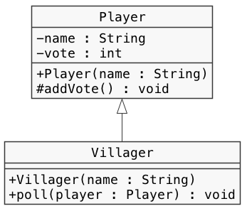

# クラス設計　Lv7

----

### 教材制作者へ

特に指示の無い場合は**リスト形式（一問一答）**とする。

----

## Q1

クラス図に示されたプログラムになるよう、空欄を埋めなさい。

ただし、メソッドなどの処理内容は省略している。

```java
public class Player {

  [  1  ] String name;
  [  2  ] int vote;

  public Player(String name) {
    // 略
  }

  [  3  ] void addVote() {
    // 略
  }

}

public class [  4  ] [  5  ] [  6  ] {

  public Villager(String name) {
    // 略
  }

  public void poll(Player player) {
    // 略
  }

}
```



### 選択肢

#### 1〜7すべて

- private
- public
- protected
- extends
- implements
- Player
- Villager
- Override

### ヒント1

クラス図では、クラス名、インターフェース名、フィールド名とその型、メソッド名とその引数・戻り値の型、コンストラクタとその引数、クラスやインターフェース間の関係などが記載される。

フィールド名やメソッド名の記号は、アクセス修飾子を表す。

### ヒント2

- \- private
- \+ public
- \~ package private
- \# protected

### ヒント3

クラス間の関係は線の種類で表す。

中抜き実線の矢印は、クラスの継承を表す。

BクラスがAクラスを継承しているとき、 class B extends A と書く。

答え

1. private
2. private
3. protected
4. Villager
5. extentds
6. Player

## Q2

クラス図に示されたプログラムになるよう、空欄を埋めなさい。

ただし、メソッドなどの処理内容は省略している。

```java
public [  1  ] Player {

  public void poll(Player player);

}

public class [  2  ] [  3  ] [  4  ] {

  [  5  ] String name;
  [  6  ] int vote;

  public Villager(String name) {
    // 略
  }

  @[  7  ]
  public void poll(Player player) {

  }

}
```


### 選択肢

#### 1〜7すべて

- private
- public
- protected
- extends
- implements
- Player
- Villager
- Override

### ヒント1

クラス図では、クラス名、インターフェース名、フィールド名とその型、メソッド名とその引数・戻り値の型、コンストラクタとその引数、クラスやイターフェース間の関係などが記載される。

フィールド名やメソッド名の記号は、アクセス修飾子を表す。

### ヒント2

- \- private
- \+ public
- \~ package private
- \# protected

### ヒント3

クラス間の関係は線の種類で表す。

中抜き破線の矢印は、インターフェースの実装を表す。

BクラスがAインターフェースを実装しているとき、 B implements A と書く。

答え

1. interface
2. Villager
3. implements
4. Player
5. private
6. protected
