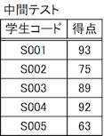
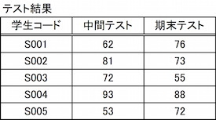
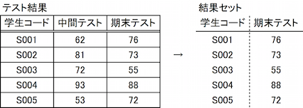

# SQL Lv3

## Q1

次のSQLが完成するように，選択肢を選びなさい。

"中間テスト"表の"得点"列の行をすべて検索する。

[1] [2] [3] [4]

[1] SELECT, INSERT, UPDATE, DELETE 
[2] 中間テスト, 学生コード, 得点, * 
[3] FROM, INTO, SET, VALUES, WHERE 
[4] 中間テスト, 学生コード, 得点, * 

### Hint1

表のデータ行の検索には，SELECTステートメントの構文を用いる。

### Hint2

SELECTステートメントの文法は

`SELECT 列名 FROM 表名`

である。

### Hint3

SQLは

`SELECT 得点 FROM 中間テスト`

となる。

答え
[1] SELECT　[2]　得点 [3] FROM　[4] 中間テスト

## Q2

次のSQLが完成するように，選択肢を選びなさい。

"中間テスト"表に，"学生コード"列が S006，"得点"列が 80 の行を追加する。

[1] [2] [3] \[4\] ('S006', 80) 

[1] SELECT, INSERT, UPDATE, DELETE 
[2] FROM, INTO, SET, VALUES, WHERE 
[3] 中間テスト, 学生コード, 得点, * 
[4] FROM, INTO, SET, VALUES, WHERE 

### Hint1

表のデータ行の追加には，INSERTステートメントの構文を用いる。

### Hint2

INSERTステートメントの文法は

`INSERT INTO 表名(列名...) VALUES (値...)`

である。

値が列と同じ順番のとき，列名は省略できる。

### Hint3

SQLは

`INSERT INTO 中間テスト VALUES ('S006', 80)

となる。

答え [1] INSERT　[2] INTO [3] 中間テスト [4] VALUES

## Q3

次のSQLが完成するように，選択肢を選びなさい。

"中間テスト"表の，"得点"列の値をすべて 0 に更新する。

[1] [2] [3] [4] = 0

[1] SELECT, INSERT, UPDATE, DELETE 
[2] 中間テスト, 学生コード, 得点, * 
[3] FROM, INTO, SET, VALUES, WHERE 
[4] 中間テスト, 学生コード, 得点, * 

### Hint1

表のデータ行の更新には，UPDATEステートメントの構文を用いる。

### Hint2

UPDATEステートメントの文法は

`UPDATE 表名 SET 列名 = 値`

である。

### Hint3

SQLは

`UPDATE 中間テスト SET 得点 = 0`

となる。

答え
[1] UPDATE　[2] 中間テスト [3] SET [4] 得点

## Q4

次のSQLが完成するように，選択肢を選びなさい。

"中間テスト"表のデータ行をすべて削除する。

[1] [2] [3]

[1] SELECT, INSERT, UPDATE, DELETE 
[2] FROM, INTO, SET, VALUES, WHERE 
[3] 中間テスト, 学生コード, 得点, * 

### Hint1

表のデータ行の削除には，DELETEステートメントの構文を用いる。

### Hint2

DELETEステートメントの文法は

`DELETE FROM 表名`

である。

### Hint3

SQLは

`DELETE FROM 中間テスト`

となる。

答え
[1] DELETE [2] FROM　[3] 中間テスト

## Q5

次のSQLが完成するように，選択肢を選びなさい。

"中間テスト"表の，"得点"列が 80 以上のデータ（行）のみ，"学生コード"列を検索する。

[1] [2] [3] [4] [5] [6] >= 80

[1] SELECT, INSERT, UPDATE, DELETE 
[2] 中間テスト, 学生コード, 得点, * 
[3] FROM, INTO, SET, VALUES, WHERE 
[4] 中間テスト, 学生コード, 得点, * 
[5] FROM, INTO, SET, VALUES, WHERE 
[6] 中間テスト, 学生コード, 得点, * 

### Hint1

表のデータ行検索には，SELECTステートメントの構文を用いる。

### Hint2

条件を用いる SELECTステートメントの文法は

`SELECT 列名 FROM 表名 WHERE 条件式`

である。

### Hint3

SQLは

`SELECT 得点 FROM 中間テスト WHERE 得点 > 80`

となる。

答え
[1] SELECT　[2]　学生コード [3] FROM　[4] 中間テスト [5] WHERE [6] 得点

## Q6

次のSQLが完成するように，選択肢を選びなさい。

"中間テスト"表の，"学生コード"列が 'S001' のデータ（行）のみ，"得点"を 80 に更新する。

[1] [2] [3] [4] = 0 [5] [6] = 'S001' 

[1] SELECT, INSERT, UPDATE, DELETE 
[2] 中間テスト, 学生コード, 得点, * 
[3] FROM, INTO, SET, VALUES, WHERE 
[4] 中間テスト, 学生コード, 得点, * 
[5] FROM, INTO, SET, VALUES, WHERE 
[6] 中間テスト, 学生コード, 得点, * 

### Hint1

表のデータ行の更新には，UPDATEステートメントの構文を用いる。

### Hint2

条件を用いるUPDATE ステートメントの文法は

`UPDATE 表名 SET 列名 = 値 WHERE 条件式`

である。

### Hint3

SQLは

`UPDATE 中間テスト SET 得点 = 80 WHERE 学生コード = 'S001'`

となる。

答え
[1] UPDATE　[2] 中間テスト [3] SET [4] 得点 [5] WHERE [6] 学生コード

## Q7

次のSQLが完成するように，選択肢を選びなさい。

"中間テスト"表の，"学生コード"列が S001 のデータ（行）をすべて削除する。

[1] [2] [3] [4] [5] = 'S001'

[1] SELECT, INSERT, UPDATE, DELETE 
[2] FROM, INTO, SET, VALUES, WHERE 
[3] 中間テスト, 学生コード, 得点, * 
[4] FROM, INTO, SET, VALUES, WHERE 
[5] 中間テスト, 学生コード, 得点, * 

### Hint1

表のデータ行の削除には，DELETEステートメントの構文を用いる。

### Hint2

条件を用いるDELETEステートメントの文法は

`DELETE FROM 表名 WHERE 条件式`

である。

### Hint3

SQLは

`DELETE FROM 中間テスト WHERE 学生コード = 'S001'`

となる。

答え
[1] DELETE [2] FROM　[3] 中間テスト [4] WHERE [5] 学生コード

## Q8

次のSQLが完成するように，選択肢を選びなさい。

"中間テスト"表の，列を制限せずにデータ（行）を検索する。

[1] [2] [3] [4]

[1] SELECT, INSERT, UPDATE, DELETE 
[2] 中間テスト, 学生コード, 得点, * 
[3] FROM, INTO, SET, VALUES, WHERE 
[4] 中間テスト, 学生コード, 得点, * 

### Hint1

表のデータ行検索には，SELECTステートメントの構文を用いる。

### Hint2

列を制限せずに検索を行うSELECTステートメントの文法は

`SELECT * FROM 表名`

である。

### Hint3

SQLは

`SELECT * FROM 中間テスト`

となる。

答え
[1] SELECT　[2]　* [3] FROM　[4] 中間テスト

## Q9

次のSQLが完成するように，選択肢を選びなさい。

"テスト結果"表の，"中間テスト"列が 90 以上，"期末テスト"列が 80 以上の"学生コード"列を検索する。

[1] [2] [3] [4] [5] [6] >= 80 [7] [8] >= 90

[1] SELECT, INSERT, UPDATE, DELETE 
[2] テスト結果, 学生コード, 中間テスト, 期末テスト, * 
[3] FROM, INTO, SET, VALUES, WHERE, AND, OR 
[4] テスト結果, 学生コード, 中間テスト, 期末テスト, * 
[5] FROM, INTO, SET, VALUES, WHERE, AND, OR 
[6] テスト結果, 学生コード, 中間テスト, 期末テスト, * 
[7] FROM, INTO, SET, VALUES, WHERE, AND, OR 
[8] テスト結果, 学生コード, 中間テスト, 期末テスト, * 

### Hint1

表のデータ行検索には，SELECTステートメントの構文を用いる。

### Hint2

条件を用いるSELECTステートメントの文法は

`SELECT 列名 FROM 表名 WHERE 条件式`

である。

### Hint3

複数の条件式がある場合は，条件式を AND（かつ） や OR（もしくは） でつなぐ。

SQLは

`SELECT 学生コード FROM テスト結果 WHERE 中間テスト >= 80 AND 期末テスト >= 90`

となる。

答え
[1] SELECT [2] 学生コード　[3] FROM  [4] テスト結果 [5] WHERE [6] 中間テスト [7] AND [8] 期末テスト

## Q10

次の検索結果を得るSQLを完成させなさい。

[1] [2], [3] [4] [5]

[1] SELECT, INSERT, UPDATE, DELETE 
[2] テスト結果, 学生コード, 中間テスト, 期末テスト, * 
[3] テスト結果, 学生コード, 中間テスト, 期末テスト, * 
[4] FROM, INTO, SET, VALUES, WHERE, AND, OR 
[5] テスト結果, 学生コード, 中間テスト, 期末テスト, * 

### Hint1

表のデータ行検索には，SELECTステートメントの構文を用いる。

### Hint2

SELECT ステートメントの文法は

`SELECT 列名 FROM 表名 WHERE 条件式`

である。

### Hint3

検索列が複数ある場合は，検索したい列名をカンマ区切りで順番に記述する。

SQLは

`SELECT 学生コード, 期末テスト FROM テスト結果'

となる。

答え
[1] SELECT [2] 学生コード　[3] 期末テスト [4] FROM [5] テスト結果
