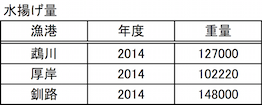

# SQL Lv4

----

**教材制作者へ**

このレベルには、IPA情報処理技術者試験の過去問を用いている。

該当の問題には<u>必ず出典を明記</u>し、出典元と表現が大きく異ならないよう作成すること。

- [過去問題](https://www.jitec.ipa.go.jp/1_04hanni_sukiru/_index_mondai.html)

特に指示の無い場合は、ア〜エ（もしくはそれに順ずる英数記号）の単数選択問題とする。

----

## Q1 別紙参照

次の結果を得るには...

## Q2 別紙参照

次の結果を得るSQL文は...

## Q3 別紙参照

ある学生表テーブルに対して...

## Q4 別紙参照

次の結果を得るSQL文は...

## Q5 別紙参照

ある学生表テーブルに対して...

## Q6 別紙参照

次の結果を得るSQL文は...

## Q7

SQLの実行結果が 148000 となるように, SQLを完成させなさい。

SELECT \[  a  \]\(\[  b  \]\) FROM 水揚げ量

[a] SUM, MAX, MIN, AVG

[b] 水揚げ量, 漁港, 年度, 重量

### Hint1

148000は、水揚げ量の中で最も大きい重量である。

### ヒント2

AVG は、結果セットから平均を計算する関数である。

MIN は、結果セットから最小値を選ぶ関数である。

### ヒント3

SUM は、指定された列の合計を計算する関数である。

MAX は、指定された列の最大値を選ぶ関数である。

答え [a] MAX [b] 重量

## Q8

SQLの実行結果が 125740 となるように, a, bを埋めて完成させなさい。

SELECT \[  a  \]\(\[  b  \]\) FROM 水揚げ量

[a] SUM, MAX, MIN, AVG

[b] 水揚げ量, 漁港, 年度, 重量

### Hint1

125740 は、重量列の平均である。

### ヒント2

MIN は、指定された列の最小値を選ぶ関数である。

MAX は、指定された列の最大値を選ぶ関数である。

### ヒント3

SUM は、指定された列の合計を計算する関数である。

AVG は、結果セットから平均を計算する関数である。

答え [a] AVG [b] 重量

## Q9

SQLの実行結果が 102220 となるように, a, bを埋めて完成させなさい。

SELECT \[  a  \]\(\[  b  \]\) FROM 水揚げ量

[a] SUM, MAX, MIN, AVG

[b] 水揚げ量, 漁港, 年度, 重量

### Hint1

102220 は、水揚げ量の中で最も小さい重量である。

### ヒント2

AVG は、結果セットから平均を計算する関数である。

MAX は、指定された列の最大値を選ぶ関数である。

### ヒント3

SUM は、指定された列の合計を計算する関数である。

MIN は、指定された列の最小値を選ぶ関数である。

答え [a] MIN [b] 重量

## Q10

"水揚げ量"　表に、下のSQL文を実行した結果として得られる値を答えなさい。

SELECT COUNT(重量) FROM 水揚げ量

### ヒント1

COUNT は、結果セットの行数を数える関数である。

### ヒント2

設問のSQLでは、"水揚げ量" 表から、"重量"列をすべて検索し、その結果セットの行数を数えている。

### ヒント3

結果セットの行数は3行である。したがって、答えは3。

答え　3

