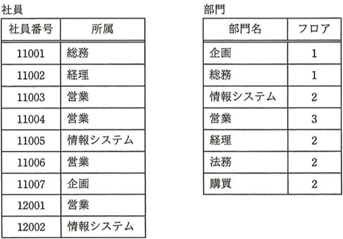
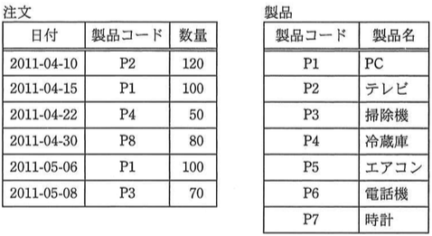
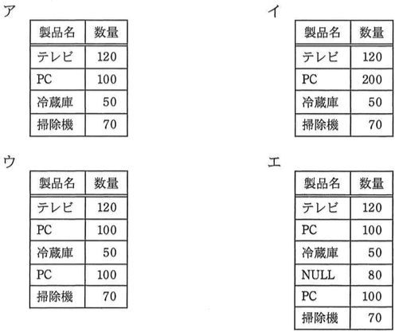
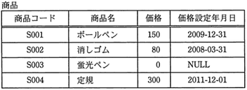
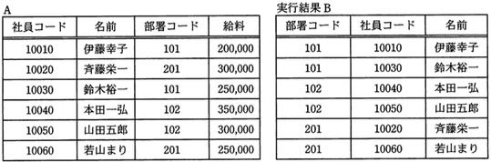

# SQL lv5

----

**教材制作者へ**

このレベルには、IPA情報処理技術者試験の過去問を用いている。

該当の問題には<u>必ず出典を明記</u>し、出典元と表現が大きく異ならないよう作成すること。

- [過去問題](https://www.jitec.ipa.go.jp/1_04hanni_sukiru/_index_mondai.html)

IPA情報処理技術者試験では、特に指示の無い場合は、ア〜エ（もしくはそれに順ずる英数記号）の単数選択問題とする。

----

## Q1 別紙参照

学年, クラス, 氏名, 点数...

## Q2 別紙参照

クラス, 氏名, 点数から...

##Q3 別紙参照

次の結果を得るSQL...

##Q4 別紙参照

次に示す売り上げ表で...

## Q5

（出典：基本情報技術者試験 平成25年度 春期分 問28 をもとに作成）

"中間テスト" 表からクラスごと, 教科ごとの平均点を求め, クラス名, 教科名の昇順に表示するSQL文中のaに入れるべき字句はどれか。

中間テスト（クラス名，教科名, 学生番号, 名前, 点数）

（SQL文） 
SELECT クラス名, 教科名, AVG(点数) AS 平均点 
　　FROM 中間テスト 
　　[  a  ] 

ア GROUP BY クラス名, 教科名 ORDER BY クラス名, AVG(点数)

イ GROUP BY クラス名, 教科名 ORDER BY クラス名, 教科名

ウ GROUP BY クラス名, 教科名, 学生番号 ORDER BY クラス名, 教科名, 平均点

エ GROUP BY クラス名, 平均点 ORDER BY クラス名, 教科名

### ヒント1

関数AVGでは、GROUP BY句で指定された列ごとに平均値を計算することができる。

### ヒント2

クラスごと, 教科ごとの平均点を求める場合、GROUP BY句で指定する列は クラス名, 教科名 となる。

そのため、ウ・エは不適である。

### ヒント3

ア・イのうち、ORDER BY句によって、クラス名, 教科名の昇順を指定しているものは、イ である。

答え　イ

## Q6

（出典：基本情報技術者試験 平成25年度 春期分 問29 をもとに作成）

"BOOKS" 表から書名に "UNIX" を含む行を全て探すために次のSQL文を用いる。aに指定する文字列として，適切なものはどれか。ここで、書名は "BOOKS" 表の "書名" 列に格納されている。

SELECT * FROM BOOKS WHERE 書名 LIKE '[  a  ]'

ア %UNIX

イ %UNIX%

ウ UNIX

エ UNIX%

### ヒント1 

LIKE句は、与えた語句を含む行を検索条件として指定できる。

### ヒント2

% は、%の部分に何らかの文字がある場合も検索条件を満たすことを示している。

例として、 'UNIX%' が指定されると、 UNIX, UNIXA, UNIXAB, ... なども検索条件を満たすものとなる。

### ヒント3

設問は、「書名に "UNIX" を含む行を全て探す」であるから、<u>"UNIX"の前後に何らかの文字がある場合</u>も検索条件とすべきである。

したがって、a に当てはまるものは %UNIX% が適している。

答え イ

## Q7 自由記述

（出典：基本情報技術者試験 平成28年度 秋期分 問29 をもとに作成）

"社員" 表と "部門" 表に対して、次のSQL文を実行して得られる値を答えよ。

SELECT COUNT(*) FROM 社員, 部門 
　　WHERE 社員.所属 = 部門.部門名 AND 部門.フロア = 2 

### ヒント1

社員.所属 = 部門.部門名の条件で、表を結合すると、

|社員.社員番号|社員.所属|部門.部門名|部門.フロア|
| :-: | :-: | :-: | :-: |
|11001|総務|総務|1|
|11002|経理|経理|2|
|11003|営業|営業|3|
|11004|営業|営業|3|
|11005|情報システム|情報システム|2|
|11006|営業|営業|3|
|11007|企画|企画|1|
|12001|営業|営業|3|
|12002|情報システム|情報システム|2|

となる。

### ヒント2

上の表の中で、 部門.フロア = 2 の条件に当てはまるものは、社員番号が 11002, 11005, 12002 の3行である。

### ヒント3

COUNT関数は、結果セットとして得らる列の行数を数える。

従って、答えは 3

答え 3

## Q8

（出典：基本情報技術者試験 平成25年度 春期分 問28 をもとに作成）

"注文" 表と "製品" 表に対して, 次のSQL文を実行した結果はどれか。

SELECT 製品名, 数量 FROM 注文, 製品 
　　WHERE 注文.製品コード = 製品.製品コード 

　　
### ヒント1

注文.製品コード = 製品.製品コードの条件で、表を結合する。

### ヒント2

|注文.日付|注文.製品コード|注文.数量|製品.製品コード|製品.製品名|
| :-: | :-: | :-: | :-: | :-: |
|2011-04-10|P2|120|P2|テレビ|
|2011-04-15|P1|100|P1|PC|
|2011-04-22|P4|50|P4|冷蔵庫|
|2011-05-06|P1|100|P1|PC|
|2011-05-08|P3|70|P3|掃除機|

となる。

(製品コードがP8の行は、"製品" 表に存在しないため、除外される）

### ヒント2

設問のSQLでは、上記の結合結果から、製品.製品名と注文.数量を結果セットとして返す。

### ヒント3

結果セットとして当てはまるものは、ウである。

答え　ウ

## Q9 自由記述

（出典：応用情報技術者試験 平成23年度 秋期分 問29 をもとに作成）

価格設定年月日に NULL を含む "商品" 表に対して, 次の問合せを行った。この検索結果の行数を答えよ。

SELECT 商品コード FROM 商品 WHERE 価格設定年月日 < '2011-12-01'

### Hint1

設問のSQLでは、"商品" 表から、価格設定年月日列が 2011-12-01 未満のものを選び出す。

### Hint2

NULL は、値が存在しない状態 を表すため、条件判定から除外される。

### Hint3

したがって条件に当てはまるのは、商品コード S001, S002 の2行である。

答え　2

## Q10

（出典：応用情報技術者試験 平成22年度 春期分 問33 をもとに作成）

表Aから実行結果Bを得るためのSQLはどれか。

ア　SELECT 部署コード, 社員コード, 名前 FROM A 
　　　GROUP BY 社員コード 

イ　SELECT 部署コード, 社員コード, 名前 FROM A 
　　　GROUP BY 部署コード 

ウ　SELECT 部署コード, 社員コード, 名前 FROM A 
　　　ORDER BY 社員コード, 部署コード 

エ　SELECT 部署コード, 社員コード, 名前 FROM A 
　　　ORDER BY 部署コード, 社員コード 

### ヒント1

実行結果Bは、表Aの部署コード、社員コード、名前の検索結果セットに対し、部署コードを昇順で並び替えた上で、社員コードを昇順で並び替えたものである。

### ヒント2

GROUP BY 句は重複を集約するための句であるため、ア・イは適さない。

### ヒント3

ウ・エのうち、部署コード・社員コードの順で昇順並び替えを行っているものは、エである。

こたえ　エ

