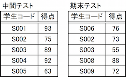
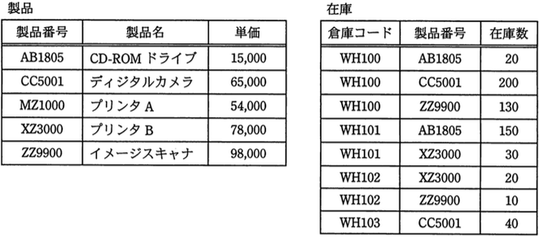
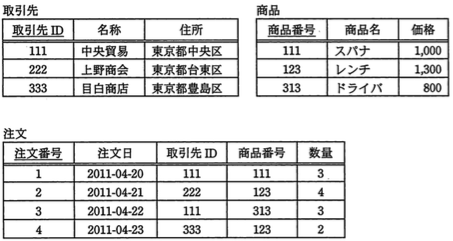
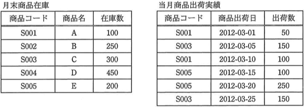
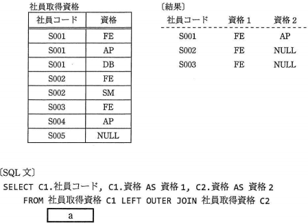

# SQL Lv7

----

**教材制作者へ**

このレベルには，IPA情報処理技術者試験の過去問を用いている。

該当の問題には出典を明記し，出典元と表現が大きく異ならないよう作成すること。

- [過去問題](https://www.jitec.ipa.go.jp/1_04hanni_sukiru/_index_mondai.html)

IPA情報処理技術者試験では，特に指示の無い場合は，ア〜エ（もしくはそれに順ずる英数記号）の単数選択問題とする。

----

## Q1

"中間テスト" 表と "期末テスト" 表を元に，期末テストの得点がない学生コードが検索されるよう，SQLを完成させなさい。

SELECT 中間テスト.学生コード FROM 中間テスト 
　　[a] [b] 期末テスト 
　　ON 中間テスト.[c] = 期末テスト.[d] 
　　WHERE 期末テスト.[e] [f] NULL 

[a] INNER, LEFT OUTER, RIGHT OUTER, JOIN 
[b] INNER, LEFT OUTER, RIGHT OUTER, JOIN 
[c] 中間テスト, 期末テスト, 学生コード, 得点 
[d] 中間テスト, 期末テスト, 学生コード, 得点 
[e] 中間テスト, 期末テスト, 学生コード, 得点 
[f] IS, IS NOT, =, != 

### Hint1

学生コードを基準として， "中間テスト" 表に "期末テスト" 表を左結合した上で，期末テスト.得点 が NULL であるものを検索することで，期末テストの得点がない行を検索できる。

### Hint3

対応する行が無い場合は，値をNULLとして列を結合するのは，外部結合である。

### Hint3 

学生コードを基準として，"中間テスト" 表に対して"期末テスト"表を左外部結合すると，"中間テスト" 表の学生コードに対応する，"期末テスト" 表の行が結合される。

したがって，条件を満たすSQL文は

SELECT 中間テスト.学生コード FROM 中間テスト 
　　LEFT OUTER JOIN 期末テスト 
　　ON 中間テスト.学生コード = 期末テスト.学生コード 
　　WHERE 期末テスト.得点 IS NULL 

である。

こたえ　[a] LEFT OUTER [b] JOIN [c] 学生コード [d] 学生コード [e] 得点　[f] IS

## Q2

"中間テスト" 表と "期末テスト" 表を元に，中間テストの得点がない学生コードが検索されるよう，SQLを完成させなさい。

SELECT 中間テスト.学生コード FROM 中間テスト 
　　[a] [b] 期末テスト 
　　ON 中間テスト.[c] = 期末テスト.[d] 
　　WHERE 中間テスト.[e] [f] NULL 

[a] INNER, LEFT OUTER, RIGHT OUTER, JOIN 
[b] INNER, LEFT OUTER, RIGHT OUTER, JOIN 
[c] 中間テスト, 期末テスト, 学生コード, 得点 
[d] 中間テスト, 期末テスト, 学生コード, 得点 
[e] 中間テスト, 期末テスト, 学生コード, 得点 
[f] IS, IS NOT, =, != 

### Hint1

学生コードを基準として， "中間テスト" 表に "期末テスト" 表を結合した上で，期末テスト.得点 が NULL であるものを検索することで，期末テストの得点がない行を検索できる。

### Hint2

対応する行が無い場合は，値をNULLとして列を結合するのは，外部結合である。

### Hint3 

学生コードを基準として，"中間テスト" 表に対して"期末テスト"表を右外部結合すると，"期末テスト" 表の学生コードに対応する，"中間テスト" 表の行が結合される。

したがって，条件を満たすSQL文は

SELECT 中間テスト.学生コード FROM 中間テスト 
　　RIGHT OUTER JOIN 期末テスト 
　　ON 中間テスト.学生コード = 期末テスト.学生コード 
　　WHERE 中間テスト.得点 IS NULL 

である。

こたえ　[a] RIGHT OUTER [b] JOIN [c] 学生コード [d] 学生コード [e] 得点 [f] IS

## Q3（自由記述）

"中間テスト"　表と　"期末テスト"　表に対し，次のSQLを実行した結果として得られる値は何か。

SELECT ROUND(AVG(得点),0) 
　　FROM (SELECT 学生コード, 得点 FROM 期末テスト 
　　UNION SELECT 学生コード, 得点 FROM 中間テスト 
　　) AS UNIONED 

　　
### ヒント1

UNION句は，検索結果を上下に結合した表を作る。

"UNIONED" 表は，期末テストの表と中間テストの表が1つの表に結合した結果セットとなる。

### ヒント2

AVG関数により，ヒント1の結果セットから，得点の平均を計算する。

これはつまり，中間テスト・期末テストの全ての得点の平均である。

結果は，77.60000...になる。

### ヒント3

ROUND関数により，小数点以下が四捨五入される。

よって，答えは78になる。

答え 78
　　
## Q4（自由記述）

"中間テスト"表と"期末テスト"表に対し，次のSQLを実行した結果として得られる値は何か。

SELECT 学生コード FROM 期末テスト 
　　GROUP BY 学生コード 
　　HAVING 得点 <= (SELECT AVG(得点) from 中間テスト) 
　　ORDER by 得点 DESC 
　　FETCH FIRST 1 ROWS ONLY 

### ヒント1

サブクエリの検索結果を先に計算する。

(SELECT AVG(得点) from 中間テスト) は，82.4000...になる。

### ヒント2

期末テストの結果から，

GROUP BY 学生コード HAVING POINT <= 72.2 

の検索結果を考えると，

|学生コード|得点|
| :-: | :-: |
|S002|73|
|S003|55|
|S006|76|
|S009|72|

になる。

### ヒント3

ORDER BY 得点 DESC FETCH FIRST 1 ROWS ONLY

から，得点列が降順になるように行を並び替え，1行を取り出す。

|学生コード|得点|
| :-: | :-: |
|S006|72|

このうち，学生コードのみを検索結果としているので，答えは S009

答え S006

## Q5

（出典：データベーススペシャリスト試験 平成25年度 春期分 午前II 問5 をもとに作成）

"社員" 表から，役割名がプログラマである社員が3人以上所属している部門の部門名を取得するSQL文はどれか。ここで，実線の下線は主キーを表す。

社員（<u>社員番号</u>，部門名，社員名，役割名）

ア　SELECT 部門名 FROM 社員 
　　　　GROUP BY 部門名 
　　　　HAVING COUNT(*) >= 3 
　　　　WHERE 役割名 = 'プログラマ' 

イ　SELECT 部門名 FROM 社員 
　　　　WHERE COUNT(*) >= 3 AND 役割名 = 'プログラマ' 
　　　　GROUP BY 部門名 

ウ　SELECT 部門名 FROM 社員 
　　　　WHERE COUNT(*) >= 3 
　　　　GROUP BY 部門名 
　　　　HAVING 役割名 = 'プログラマ' 

エ　SELECT 部門名 FROM 社員 
　　　　WHERE 役割名 = 'プログラマ' 
　　　　GROUP BY 部門名 
　　　　HAVING COUNT(*) >= 3 

### ヒント1

SQL構文において，句の記述にはいくつかルールが存在する。

(1) GROUP BY句をWHERE句の前に記述することはできない。

### ヒント2

(2) WHERE句に，集約関数を記述することはできない。

### ヒント3

アは，上記(1)に反しており，適切な構文ではない。
イ・ウは，上記(2)に反しており，適切な構文ではない。

エは，(1),(2)のルールが守られている。また，検索結果も設問で指定されたものと一致する。

答え：エ
　　

## Q6（自由記述）

（出典：データベーススペシャリスト試験 平成22年春期 午前Ⅱ 問14 をもとに改変）

"製品"表と"在庫"表に対し，次のSQL文を実行した結果として得られる表の行数は幾つか。

SELECT DISTINCT 製品番号 FROM 製品 
　　WHERE NOT EXISTS (SELECT 製品番号 FROM 在庫 
　　　　WHERE 在庫数 > 30 AND 製品.製品番号 = 在庫.製品番号) 

### ヒント1

SQLは，EXISTS句（副問い合わせ）を利用している。EXISTS句は，副問い合わせ式の検索結果が存在した場合を真として扱う。

### ヒント2

設問では NOT句で真・偽が反転されるため，副問い合わせ式の結果に存在しない行を"製品"表から探す。

### ヒント3

副問い合わせ式は，製品.製品番号を「在庫数が30より大きい」在庫.製品番号と比較している。検索結果は，以下のようになる。

**副問い合わせ式の検索結果**

|製品番号|
| :-: |
|CC5001|
|ZZ9900|
|AB1805|
|CC5001|

副問い合わせ式の検索結果と同じ製造番号が<u>存在しない</u>，"製品"表の行は，3行目(MZ1000)，4行目(XZ3000)の2行。DISTINCT句で省かれる重複行も存在しない。

したがって，答えは　2行。

答え　2

## Q7

（出典：データベーススペシャリスト試験 平成23年度 特別試験 午前Ⅱ 問8 をもとに作成)

"取引先"表，"商品"表，"注文"表の3表を基底表とするビュー"注文123"を操作するSQL文のうち，実行できるものはどれか。ここで，各表の列のうち下線のあるものを主キーとする。

（ビュー "注文123" の定義） 
CREATE VIEW 注文123 AS 
　　SELECT 注文番号, 取引先.名称 AS 取引先名, 数量 
　　　　FROM 注文, 取引先, 商品 
　　　　WHERE 注文.商品番号 = '123' 
　　　　　　AND 注文.取引先ID = 取引先.取引先ID 
　　　　　　AND 注文.商品番号 = 商品.商品番号 

ア　DELETE FROM 注文123 WHERE 取引先ID = '111'

イ　INSERT INTO 注文123 VALUES (8, '目白商店', 'レンチ', 3)

ウ　SELECT 取引先.名称 FROM 注文123

エ　UPDATE 注文123 SET 数量 = 3 WHERE 取引先名 = '目白商店'

### ヒント1

SELECT文の条件から，ビューに利用される基底表の内部結合を考える。

"注文"表の 商品番号 = 123 の2行に対し，取引先.取引先ID，商品.商品番号を外部キーが結合条件である。

**内部結合表**

<table style="text-align: center;">
  <tr>
    <th colspan="5">注文</th>
    <th colspan="3">取引先</th>
    <th colspan="3">商品</th>
  </tr>
  <tr>
    <th>注文番号</th>
    <th>注文日</th>
    <th>取引先ID</th>
    <th>商品番号</th>
    <th>数量</th>
    <th>取引先ID</th>
    <th>名称</th>
    <th>住所</th>
    <th>商品id</th>
    <th>商品名</th>
    <th>価格</th>
  </tr>
  <tr>
    <td>2</td>
    <td>2011-04-21</td>
    <td><strong>222<strong></td>
    <td><strong>123</strong></td>
    <td>4</td>
    <td><strong>222<strong></td>
    <td>上野商店</td>
    <td>東京都台東区</td>
    <td><strong>123</strong></td>
    <td>レンチ</td>
    <td>1,300</td>
  </tr>
  <tr>
    <td>4</td>
    <td>2011-04-23</td>
    <td><strong>333<strong></td>
    <td><strong>123</strong></td>
    <td>2</td>
    <td><strong>333<strong></td>
    <td>目白商店</td>
    <td>東京都豊島区</td>
    <td><strong>123</strong></td>
    <td>レンチ</td>
    <td>1,300</td>
  <tr>
</table> 

### ヒント2

内部結合表から，ビューを考える。

ビューは内部結合表から，注文番号，取引先名（取引先.名称），数量を抽出したものである。

**ビュー 注文123**

|注文番号|取引先名|数量|
| :-: | :-: | :-: |
| 2 | 上野商店 | 4 |
| 4 | 目白商店 | 2 |

### ヒント3

ビュー 注文123に実行可能なSQLを考える。

ア　注文123 には 取引先ID 行が存在せず，実行できない 
イ　注文123は 3列 であり，4列分のデータの追加は実行できない 
ウ　ビューの作成段階で，取引先.名称 は 取引先名 という名称に変更されており，実行できない 
エ　実行可能である 

答え　エ

## Q8（自由記述）

（出典：データベーススペシャリスト試験 平成24年度 春期分 午前II 問9 を改変）

ある月の"月末商品在庫"表と"当月商品出荷実績"表を使って，ビュー"商品別出荷実績"を定義した。このビューにSQL文を実行した結果の値を答えよ。

(ビュー "商品出荷実績"の定義) 
CREATE VIEW 商品別出荷実績(商品コード, 出荷実績数, 月末在庫数) 
　　AS SELECT 月末商品在庫.商品コード, SUM（出荷数）, 在庫数 
　　　　FROM 月末商品在庫 LEFT OUTER JOIN 当月商品出荷実績 
　　　　ON 月末商品在庫.商品コード = 当月商品出荷実績.商品コード 
　　　　　　GROUP BY 月末商品在庫.商品コード, 在庫数 

（SQL文） 
SELECT SUM(月末在庫数) AS 出荷商品在庫合計
　　FROM 商品出荷実験　WHERE 出荷実績数 <= 300

### ヒント1

まず，設問の「ビュー "商品出荷実績"の定義」より，月末商品在庫と当月商品出荷実績の左外部結合の結果セット（表1）を考える。

なお，表1は，理解を助けるために商品コードと商品出荷日で降順ソートしている。

**表1 月末商品在庫と当月商品出荷実績の左外部結合の結果セット**

| 商品コード | 商品名 | 在庫数 | 商品出荷日 | 出荷数 |
|:-:|:-:|:-:|:-:|:-:|
| S001 | A | 100 | 2012-03-01 | 50 | 
| S001 | A | 100 | 2012-03-10 | 100 | 
| S002 | B | 250 | NULL | NULL |
| S003 | C | 300 | 2012-03-05 | 150 |
| S003 | C | 300 | 2012-03-25 | 150 |
| S004 | D | 450 | NULL | NULL |
| S005 | E | 200 | 2012-03-15 | 100 |
| S005 | E | 200 | 2012-03-20 | 250 |

### ヒント2

次に，表1を元に，商品別出荷実績 ビューの結果（表2）を考える。

**表2 商品別出荷実績ビュー**

| 商品コード | 出荷実績数 | 月末在庫数 | 
|:-:|:-:|:-:|
| S001 | 150 | 100 | 
| S002 | NULL | 250 | 
| S003 | 300 | 300 | 
| S004 | NULL | 450 |
| S005 | 350 | 200 |

## ヒント3

表2から，設問の「SQL文」の実行結果を考える。

このSQLは，出荷実績数が300以下の行に限り，月末在庫数を合計したものを結果として検索する。

対象となる行は

| 商品コード | 出荷実績数 | 月末在庫数 | 
|:-:|:-:|:-:|
| S001 | 150 | 100 | 
| S003 | 300 | 300 | 

の2行であり，この月末在庫数の合計は400となる。

答え　400

## Q9

（出典：データベーススペシャリスト試験 平成27年度 春期分 午前II 問8 をもとに作成）

"社員取得資格"表に対し，SQL文を実行して結果を得た。SQLの a に入る字句はどれか。

ア　ON C1.社員コード = C2.社員コード 
　　　　AND C1.資格 = 'FE' AND C2.資格 = 'AP' 
　　WHERE C1.資格 = 'FE' 

イ　ON C1.社員コード = C2.社員コード 
　　　　AND C1.資格 = 'FE' AND C2.資格 = 'AP' 
　　WHERE C1.資格 IS NOT NULL

ウ　ON C1.社員コード = C2.社員コード 
　　　　AND C1.資格 = 'FE' AND C2.資格 = 'AP' 
　　WHERE C2.資格 = 'AP'

エ　ON C1.社員コード = C2.社員コード 
　　　　AND C1.資格 = 'FE' AND C2.資格 = 'AP' 

### ヒント1

エは，ON句の条件で左外部結合を行った結果に対し，C1.資格が 'FE'，C2.資格が 'AP' となるものだけを検索する。

設問の結果では，C2.資格の行に NULL が存在しているので，左外部結合の結果に関わらず，エは条件とそぐわない。

### ヒント2

ア〜ウは，ON句の条件で左外部結合を行った結果が同一となる。

**表1 ア〜ウの左外部結合の結果**

| C1.社員コード | C1.資格 | C2.資格 |
|:-:|:-:|:-:|
| S001 | FE | AP |
| S001 | AP | NULL |
| S001 | DB | NULL |
| S002 | FE | NULL |
| S002 | SM | NULL |
| S003 | FE | NULL |
| S004 | AP | NULL |
| S005 | NULL | NULL |

### ヒント3

表1から，設問の結果を得る条件にいは，C1.資格 = 'FE' が合致する。

答え　ア

## Q10

（出典：データベーススペシャリスト試験 平成28年度 春期分 午前II 問9 をもとに作成）

次のSQLと同じ検索結果が得られるSQLはどれか。

SELECT DISTINCT TBL1.COL1 FROM TBL1 
　　WHERE COL1 IN (SELECT COL1 FROM TBL2)

ア　SELECT DISTINCT TBL1.COl1 FROM TBL1 
　　　　UNION SELECT TBL2.COL1 FROM TBL2 

イ　SELECT DISTINCT TBL1.COl1 FROM TBL1 
　　　　WHERE EXISTS 
　　　　(SELECT * FROM TBL2 WHERE TBL1.COL1 = TBL2.COL1) 

ウ　SELECT DISTINCT TBL1.COl1 FROM TBL1, TBL2 
　　　　WHERE TBL1.COL1 = TBL2.COL1 
　　　　AND TBL1.COL2 = TBL2.COL2 

エ　SELECT DISTINCT TBL1.COl1 FROM TBL1 LEFT OUTER JOIN TBL2 
　　　　ON TBL1.COL1 = TBL2.COL1

### ヒント1

問題文のSQLは，"TBL2"表のCOL1列に存在する値と同値のものを"TBL1"表のCOL1列から参照し，重複行を取り除いたものを検索結果として得る。

### ヒント2

ウは，列どうしの値の比較にCOL2列を用いており，条件に合わない。

アは，UNION句によって"TBL1"表の検索結果と"TBL2"表の検索結果の行を全て得るため，条件にあわない。

### ヒント3

エは，LEFT OUTER JOIN句(左外部結合）を利用している。 
設問の場合，COL1の値が一致することを条件に，"TBL1"表に"TBL2"表が左外部結合される。 このとき，TBL2.COL1 の値と一致しない TBL1.COL1 の行は<u>省かれない</u>。 
よって，条件にあわない。 

イは，EXISTS句（副問い合わせ）を利用している。EXISTS句は，副問い合わせ式の検索結果が存在した場合を真として扱う。この設問では，<u>TBL1.COL1 の値と TBL2.COL1 の値が一致した場合，EXISTS句は真となる</u>ので，検索結果は設問のSQLと合致する。

答え　イ
　　　　
　
