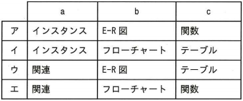
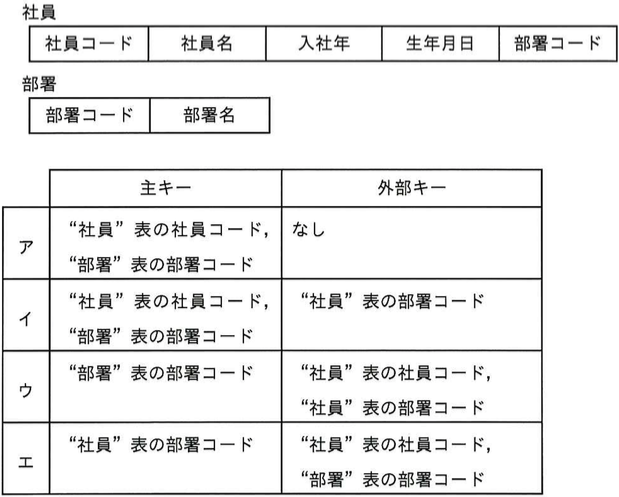
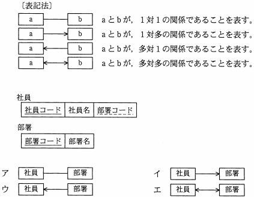

# Lv2

----

**教材制作者へ**

このレベルには，IPA情報処理技術者試験の過去問を用いている。

該当の問題には出典を明記し，出典元と表現が大きく異ならないよう作成すること。

- [過去問題](https://www.jitec.ipa.go.jp/1_04hanni_sukiru/_index_mondai.html)

IPA情報処理技術者試験では，特に指示の無い場合は，ア〜エ（もしくはそれに順ずる英数記号）の単数選択問題とする。

 
 - 注意
 	- アンダーライン等がgithubで消えて見える場合があるので，その場合は過去問やソースコード中の `<u>...</u>` を直接確認してください。

----

## Q1

（出典：ITパスポート試験　平成28年秋期分 問88 をもとに作成）

  関係データベースにおいて、正規化を行う目的はどれか

  ア　関連するデータベースをポインタで結び,アクセス効率を高める。  
  イ　データにエラーを訂正する符号を付加して,信頼性を高める。   
  ウ　データを暗号化して,セキュリティを確保する。   
  エ　データを重複してもたないことなどによって,保全性を高める。  

### ヒント1

正規化は，関係データベースの定義手法のひとつである。

### ヒント2

テーブルを定義した段階で、実データや予想されるデータをもとに、属性やレコードの無駄や不整合を排除し、テーブルを分離・編集しながら全体的なテーブルの定義を行う。

### ヒント3

正規化を行うことで、データ間の従属関係を明らかにし，テーブルごとのデータの保守・管理が容易になる。

  答え　エ
 
## Q2 ドロップダウン

（出典：ITパスポート試験　平成28年春期分　問84　をもとに作成）

  データベースを設計するときに,データの関連を整理して表現することを目的として使われるものはどれか。

- E-R図
- アローダイアグラム
- ガントチャート
- フローチャート
  
### ヒント1

フローチャートは，処理の内容・種類と流れ（処理順序）を図示するもので，アルゴリズムやプロセスの表現に利用できる。

### ヒント2

ガントチャートは，作業計画やその実績を時間軸に基づいて図示するもので，システム開発などの工程管理に利用できる。

### ヒント3

アローダイアグラムは，計画を進めていくための作業手順の関連とその工数を図で表すもので，システム開発などの工程分析に利用できる。

E-R図はシステムで取り扱いたいデータを、実体と属性，実体どうしの関連の観点から図で表現するもので，データベースの設計に必要なデータモデルの表現に利用できる。

  答え　E-R図
 

## Q3 ドロップダウン

（出典：ITパスポート試験　平成27年秋期分　問52　をもとに作成）

  関係データベースを構築するための作業を,a~cに分けて行うとき、作業の順序として適切なものはどれか。
  
  a　業務で使用するデータ項目の洗い出し
  b　表の作成
  c　レコードの挿入
  
- a　→　b　→　c
- a　→　c　→　b
- b　→　a　→　c
- b　→　c　→　a
  
### ヒント1

関係データベースの構築は，概念データモデルの作成，論理データモデルの作成，物理データモデルの作成の順に行う。

### ヒント2

概念データモデルの作成では，システム化する物事や業務に必要なデータを洗い出し，データの実体やデータ間の関連を確認する。

### ヒント3

概念データモデルの作成では，概念データモデルをコンピュータで実現可能な形に変換し，表を作成する。

物理データモデルの作成では，論理データモデルの表をコンピュータ上に作成する。

  答え　a　→　b　→　c

## Q4

（出典：ITパスポート試験　平成27年秋期分　問54　をもとに作成）

  関係データベースの設計に関する説明において,a~cに入れる字句の適切な組み合わせはどれか。
  
  対象とする業務を分析して,そこで使われるデータを洗い出し,実体や[a]から成る[b]を作成する。作成した[b]をもとに,
  [c]を設計する

### ヒント1

関係データベースの構築は，概念データモデルの作成，論理データモデルの作成，物理データモデルの作成の順に行う。

### ヒント2

概念データモデルの作成では，システム化する物事や業務に必要なデータを洗い出し，データの実体やデータ間の関連を確認する。

### ヒント3

論理データモデルの作成では，概念データモデルをコンピュータで実現可能な形に変換し，表を作成する。

物理データモデルの作成では，論理データモデルの表をコンピュータ上に作成する。

  答え　ウ

## Q5

（出典：ITパスポート試験　平成26年秋期分　問68 をもとに作成）

  関係データベースの表を正規化することによって得られる効果として,適切なものはどれか。
   
  ア　使用頻度の高いデータを同じ表にまとめて,更新時のディスクアクセス回数を減らすことができる。  
  イ　データの重複を排除して,更新時におけるデータの不整合の発生を防止することができる。   
  ウ　表の大きさを均等にすることで,主記憶の使用効率を向上させることができる。   
  エ　票の数を減らすことで,問い合わせへの応答時間を短縮することができる。   
  
### ヒント1

正規化は，関係データベースの定義手法のひとつである。

### ヒント2

テーブルを定義した段階で、実データや予想されるデータをもとに、属性やレコードの無駄や不整合を排除し、テーブルを分離・編集しながら全体的なテーブルの定義を行う。

### ヒント3

正規化を行うことで、データ間の従属関係を明らかにし，テーブルごとのデータの保守・管理が容易になる。

  答え　イ

## Q6

（出典：ITパスポート試験　平成25年秋期分　問51　をもとに作成）

  関係データベースの表に設定する主キー,外部キー及びインデックスのうち,一つの表に対して複数設定できるものだけを全て挙げたものはどれか。
  
  ア　インデックス   
  イ　外部キー,インデックス   
  ウ　主キー   
  エ　主キー,外部キー,インデックス   
  
### ヒント1

外部キーは，表の間の参照整合性を明らかにするもので，他方の表にある同一の属性を元に，他の表のデータと結合できることを示す。

### ヒント2

インデックスは，データの内部的な索引で，大量のデータの中から高速に検索するための利用できる。

### ヒント3

主キーは，データ間の関数従属性を明らかにするもので，従属するデータ項目が一意である（重複しない）ことを示す識別子となる。

主キーはタプルが重複しないことを示すため，1つの表に対して複数設定することはできない。

外部キー，インデックスは1つの表に複数設定できる。

  答え　イ
  
## Q7

（出典：ITパスポート試験　平成25年春期分　問55　を元に作成）

  関係データベースを使い"社員"表と"部署"表を作成して社員情報を管理する。
  "社員"表と"部署"表に,必要に応じて設定する主キーと外部キーの適切な組合わせはどれか。ここで,社員は必ず"部署"表に存在する部署に所属するものとし,
  社員データの追加や更新をするときには,参照制約を利用して整合性を確保するものとする。
  

  
### ヒント1

主キーは，表のデータ間の関数従属性を明らかにするもので，従属するデータ項目が一意である（重複しない）ことを示す識別子となる。

外部キーは，表の間の参照整合性を明らかにするもので，他方の表にある同一の属性を元に，他の表のデータと結合できることを示す。

### ヒント2

"社員"表の中で，複数人が被ることのない識別子として割り当てることができるのは，社員コードである。

（社員名は同性同名の社員が，入社年は同時に入社した社員が，生年月日は同じ日に生まれた社員が，部署コードは同じ部署がタプル間で重複する恐れがある）

### ヒント3

同様に，"部署"表の中で，複数部署が被ることのない識別子として割り当てることができるのは部署コードである。

"社員"表に記録された社員の部署名を調べることは，"社員"表の部署コードをもとに，"部署"表の部署名を参照することで実現できる。したがって，社員"表の部署コードは，外部の表のデータを参照するための外部キーである。

まとめると，

- "社員"表の主キーは社員コード
- "部署"表の主キーは部署コード
- "社員"表の部署コードは，"部署表"と照らしあわせるための外部キー

  答え　イ
 
## Q8
（出典：ITパスポート試験　平成24年秋期分　問53 を元に作成）

  関係データベースの設計で用いられるE-R図が表現するものは何か。
  
  ア　時間や行動などに応じて変化する状態の動き   
  イ　システムの入力データ,処理,出力データの関係   
  ウ　対象世界を構成する実態(人,物,場所,事象など)と実体間の関連   
  エ　データの流れに着目したときの,業務プロセスの動き   
  
### ヒント1

E-R図は，システム化する物事や業務に必要なデータを洗い出し，データの実体やデータ間の関連を確認する段階である「
概念データモデルの作成」で利用される。

### ヒント2

E-R図はシステムで取り扱いたいデータを、実体と属性，実体どうしの関連の観点から図で表現するもので，データベースの設計に必要なデータモデルの表現に利用できる。

### ヒント3

  答え　ウ
  
## Q9
（出典：ITパスポート試験　平成22年春期分　問83 を元に作成）

  関係データベースにおいて主キーを指定する目的はどれか。
  
  ア　主キーに指定した属性(列)で,複数のレコード(行)を同時に特定できるようにする。  
  イ　主キーに指定した属性(列)で,レコード(行)を一意に識別できるようにする。  
  ウ　主キーに指定した属性(列)に対し,検索条件を指定できるようにする。  
  エ　主キーに指定した属性(列)を算術演算の対象として扱えるようにする。  
  
### ヒント1

主キーは，表のデータ間の関数従属性を明らかにするものである。

### ヒント2

主キーは，従属するデータ項目が一意である（重複しない）ことを示す識別子となる。

### ヒント3

  答え　イ

## Q10

（出典：ITパスポート試験　平成21年秋期分　問84 を元に作成）

  関係データベースの主キーに関する記述のうち、適切なものはどれか。
  
  ア　関係データベースの各表は,主キーだけで関係付けられる。 
  イ　主キーとして指定した項目は,NULLを属性値としてもつことができる。 
  ウ　一つの表において,主キーとして指定した項目の値に同一のものがあってもよい。 
  エ　一つの表において,複数の項目を組み合わせて主キーとしてもよい。 
  
### ヒント1

主キーは，従属するデータ項目が一意である（重複しない）ことを示す識別子となる。

### ヒント2

したがって，主キーが空（存在しない）となるような，NULLは許可されない。

また，主キーが重複することは許可されない。

### ヒント3

関係データベースの表間では，参照や照らし合わせを行うことでデータの関係を表す外部キーも使うことができる。

主キーは，複数の属性や項目を組み合わせた複合主キーとなってもよい。

例として，学校などでは Aクラスの15番 といった形でクラスと出席番号で個人を特定できる。このように，複数の属性を組み合わせた主キー（複合主キー）も存在する。

  答え　エ
  
  
## Q11
（出典：ITパスポート試験　平成23年秋期分　問57 を元に作成）

  社員数が50人で,部署が10人ある会社が,関係データベースで社員や部署の情報を管理している。
  "社員"表と"部署"表の関係を示したE-R図はどれか。ここで,1人の社員が複数部署に所属することはない。
  下線のうち実践は主キーを,破線は外部キーを表す。E-R図の表記は次のとおりとする。
  
  
  
### ヒント1

"社員"表の外部キーである部署コードを用いることで，"社員"表の情報と"部署"表の情報を照らし合わせることができる。

### ヒント2

設問より，1人の社員が複数部署に所属することはない。つまり，ある部署には沢山の社員がいる。

### ヒント3

- 社員は1つの部署コードをもつ（社員が所属できる部署は1つ）
- ある部署コードをもつ社員は沢山いる

を満たす関係は，社員対部署が他対1の関係である。これを表す図はウ。

  答え　ウ
  
    
