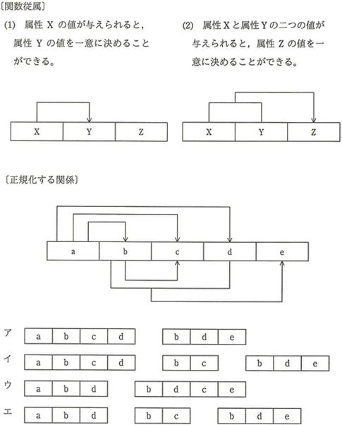
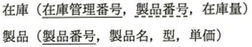
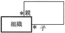
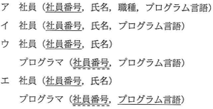
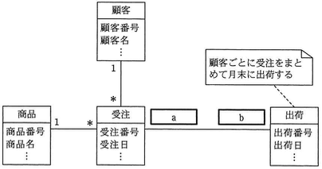
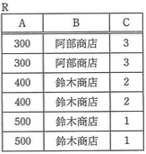
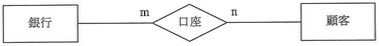
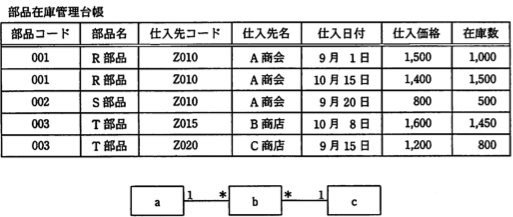

# データモデリング Lv5

----

**教材制作者へ**

このレベルには，IPA情報処理技術者試験の過去問を用いている。

該当の問題には出典を明記し，出典元と表現が大きく異ならないよう作成すること。

- [過去問題](https://www.jitec.ipa.go.jp/1_04hanni_sukiru/_index_mondai.html)

IPA情報処理技術者試験では，特に指示の無い場合は，ア〜エ（もしくはそれに順ずる英数記号）の単数選択問題とする。

 
 - 注意
 	- アンダーライン等がgithubで消えて見える場合があるので，その場合は過去問やソースコード中の `<u>...</u>` を直接確認してください。

----

## Q1

（出典：応用情報技術者試験 平成28年春期分 午前 問27 をもとに作成）

関数従属を次のように表記するとき，属性a〜eで構成される関係を第3正規形にしたものはどれか。

### ヒント1

第1正規形とは，非正規形の表に対し，属性の中に重複や繰り返しとなる項目が残らないように属性を分けたものである。

第2正規形とは，第1正規形の表に対し，主キー・複合キーによって，部分関数従属となる属性を，完全関数従属となるように表に分けたものである。

第3正規形とは，第2正規形の表に対し，主キー・複合キー以外の属性によって，推移的関数従属となる部分を完全関数従属となるように表に分けたものである。

### ヒント2

正規化する関係では，属性aが主キーとなっている。そこで，属性aに関わる関数従属以外（つまり，推移的関数従属のもの）を，別の表に分離する。

### ヒント3

属性a以外に，設問の関数従属(1)，(2)の関係にあるものは，b→c，{b，d}→eの二つである。

ここで，属性cは，a→cの関係も考えられるが，関数従属(1)の説明から，属性aがなくとも属性bだけで，属性cを一意に定めることができるため，a→cの関係は分離してもかまわない。

この条件に当てはまるものは，エである。（a→b，a→d，b→c，{b，d}→eの関数従属が全て成り立っている）

答え　エ

## Q2 ドロップダウン

（出典：応用情報技術者試験 平成28年春期分 午前 問29 をもとに作成）

次の表において，"在庫"表の製品番号に定義された参照制約によって拒否される可能性がある操作はどれか。ここで，実線の下線は主キーを，破線の下線は外部キーを表す。

- "在庫"表の行削除
- "在庫"表の表削除
- "在庫"表への行追加
- "製品"表への行追加

### ヒント1

参照制約（外部キー）を表に設定するためには，参照元のキーの変更操作にあわせて，外部キーをどのように保つか定義する必要がある。

設問では，"在庫"表の製品番号が外部キーであり，この製品番号は"製品"表の製造番号の主キーを参照している。

### ヒント2

つまり，"製品"表の製造番号の更新・削除や，"製品"表の製造番号を用いた"参照"表の追加の操作に参照制約の影響がある。

"在庫"表の行削除と，"在庫"表の表削除は，"在庫"表の削除に関わるものである。よって，参照制約によって拒否されることはない。

### ヒント3

"製品"表への行追加も，"製品"表の製造番号の更新・削除に関わるものではない。よって，参照制約によって拒否されることはない。

"在庫"表への行追加では，"製品"の製品番号に値がないものを"在庫"表に追加しようとすると，参照制約によって拒否される可能性がある。

答え　"在庫"表への行追加

## Q3　ドロップダウン

（出典：応用情報技術者試験 平成26年秋期分 午前 問26 をもとに作成）

関係R(A，B，C，D，E，F)において，関数従属A→B，C→D，C→E，{A,C}→Fが成立するとき，関係Rの候補キーはどれか。

- A
- C
- {A，C}
- {A，C，E}

### ヒント1

関数従属は，ある属性（もしくは属性の組）の値によって他の属性の値を一意に定めることができるものをいう。

候補キーとは，属性の関係のタプルを一意に識別できる属性（もしくは属性の組みあわせで極小のもの）をいう。

### ヒント2

候補キーとして，AからFの属性の関係を一意に識別できる属性（もしくは属性の組）は，関数従属で起点となる属性の組み合わせである。

設問の場合，属性Aの値でBの値が，Cの値でDとEの値が，AとCの値でFの値が一意に定められる。

### ヒント3

したがって，A，Cの二つの属性の組で，B，D，E，Fをそれぞれ一意に定めることができる。

答え　{A，C}

## Q4 

（出典：応用情報技術者試験 平成25年秋期分 午前 問45 をもとに作成）

次のE-R図の解釈として，適切なものはどれか。ここで，\* \*は多対多の関連を示し，自己参照は除くものとする。

ア　ある組織の親組織の数が，子組織の数より多い可能性がある。

イ　全ての組織は必ず子組織をもつ。

ウ　組織は2段階の階層構造である。

エ　組織はネットワーク構造になっていない。

### ヒント1

E-R図から，親組織には複数の子組織があり，子組織には複数の親組織があることがわかる。

したがって，親組織対子組織は，多対多の関係である。

また，子組織がさらに孫組織などを持つことができる。

### ヒント2

このように，親組織・子組織が違いに複数の組織をもち，また親・子・孫...というように循環的に組織を構成することができるため，ネットワーク構造を作成できる。よってエは適さない。

親・子・孫...というように循環的に組織を構成できるので，2段階以上の階層構造を作ることができる。よってウは適さない。

### ヒント3

多対多の関係では，片方が0である可能性も考えられる。子を持つ組織と持たない組織の両方がありうるので，イは適さない。

多対多の関係では，ある組織が複数の親組織や子組織を持つ可能性も考えられる。この数は制限されないため，ある組織の親組織が子組織の数より多いことはありえる。よってアは適している。

答え　ア

## Q5

（出典：応用情報技術者試験 平成25年度春期分 問28 をもとに作成）

"プログラマは全て社員であり，社員の約10%を占める。社員は社員番号と氏名をもち，職種がプログラマである場合は，使用できるプログラム言語を一つ以上もつ。"という状況を記録するデータベース設計案として，適切なものはどれか。ここで，実線の下線は主キーを，破線の下線は外部キーを表す。

### ヒント1

設問にでてくるキーワードや，数の情報から，最も適している設計案を選ぶ。

### ヒント2

設問から，プログラマは全て社員であるが，社員の90%はプログラマではない他の職種であることがわかる。したがって，"社員"表と，職種を表す"プログラマ"表は分けられていることが望ましい。このため，アとイは適さない。

### ヒント3

設問から，プログラマである場合は，使用できるプログラム言語を複数持てることがわかる。
したがって，同じ社員（社員番号が同じ値）に，複数のプログラム言語が関係できる必要がある。

これを満たす設計案は，エ（"プログラマ"表の社員番号とプログラム言語が複合キーであり，プログラム言語が異なる社員番号の組が許容される）である。

答え　エ

## Q6 ドロップダウン

（出典：応用情報技術者試験 平成27年度秋期分 問28 をもとに作成）

関係R(A，B，C，D，E，F)において，次の関数従属が成立するとき，候補キーとなるのはどれか。

(関数従属) 
A→B，A→F，B→C，C→D，{B，C}→E，{C，F}→A 

- B
- {B，C}
- {B，F}
- {B，D，E}

### ヒント1

候補キーがBの場合は，B→Cによって，{B，C}のみが導かれる。

### ヒント2

候補キーが{B，C}の場合は，B→C, C→D，{B，C}→Eによって，{B，C，D，E}のみが導かれる。

### ヒント3

候補キーが{B，D，E}の場合は，B→C，C→Dによって，{B，C，D，E）のみが導かれる。

{B，F}の場合は，B→C，C→D，{B，C}→E，{C，F}→Aによって，{A，B，C，D，E，F}の関係Rが全て導かれる。

答え　{B,F}

## Q7　ドロップダウン

（出典：Lv6 応用情報技術者試験 平成26年度秋期分 問27 をもとに作成）

その月に受注した商品を，顧客ごとにまとめて月末に出荷する場合，受注クラスと出荷クラスの間の関連a，bに入る多重度の組合せはどれか。ここで，出荷のデータは実績に基づいて登録される。また，モデルの表記にはUMLを用いる。

[a] 1，1..\*，0..1

[b] 1，1..\*，0..1

### ヒント1

設問から，出荷が行われるためには，必ず顧客ごとの受注が行われなければならない。
そのため，出荷クラスからみた受注クラスは，必ず1つ以上存在する。

つまり，出荷クラスからみた受注クラスの多重度は 1..\* である。

### ヒント2

受注は，月末にまとめて行われる。

そのため，受注に対して複数の出荷が存在することはありえない。

### ヒント3

また，受注・出荷ともに属性に受注日・出荷日という日ごとでデータが追加されるものであるから，**受注はされているが，出荷が行われていない状況**がありえる。

これらの条件を満たすためには，受注クラスからみた出荷クラスの多重度が 0..1 である必要がある。

答え　[a] 1..\*　[b] 0..1

## Q8 ドロップダウン

（出典：応用情報技術者試験 平成24年度秋期分 問26 をもとに作成）

六つのタプルからなる関係Rの単一の属性間において成立する全ての関数従属性をあげたものはどれか。ここで，*X→Y*は，*X*が*Y*を関数的に決定することを表す。

- A→B
- A→C，C→A
- A→B，A→C，C→A，C→B
- A→B，A→C，B→C，C→A，C→B

### ヒント1

関数従属は，ある属性（もしくは属性の組）の値によって他の属性の値を一意に定めることができる（関数的に決定できる）ものをいう。

A→Bの場合，300→阿部商店，400→鈴木商店，500→鈴木商店と一意に定めることができる。

### ヒント2

A→Cの場合，300→3，400→2，500→1と一意に定めることができる。

同様に，C→Aも3→300，2→400，1→500と一意に定めることができる。

### ヒント3

B→Cの場合，阿部商店→3，鈴木商店→2，鈴木商店→1となる。ここで，属性Bが鈴木商店の場合は，属性Cは2もしくは1となり，一意に定めることができない。

C→Bの場合，3→阿部商店，2→鈴木商店，1→鈴木商店と一意に定めることができる。

よって，関係Rの属性間で成立する関数従属性は，A→B，A→C，C→A，C→Bである。

答え　A→B，A→C，C→A，C→B

## Q9　ドロップダウン

（出典：応用情報技術者試験 平成24年度秋期分 問27 をもとに作成）

顧客は一般に複数の銀行に預金するものとして，顧客と銀行の関連をE-R図で次のように表現する。このモデルを関係データベース上に"銀行"表，"口座"表，"顧客"表として実装する場合の記述として，適切なものはどれか。

- "銀行"表から"口座"表への対応は多対1である。
- "銀行"表中に参照制約を課した外部キーがある。
- "口座"表から"顧客"表への対応関係は1対多である。
- "口座"表には二つ以上の外部キーがある。

### ヒント1

"銀行"表から"口座"表への対応は多対1であるの場合，複数件の"銀行"が同じ"口座"1件を共有することになる。したがって適していない。

### ヒント2

"口座"表から"顧客"表への対応関係は1対多である場合も同様に，複数件の"顧客"が同じ"口座"1件を共有することになる。したがって適していない。

### ヒント3

"銀行"表中に参照制約を課した外部キーがある場合，銀行側に外部キーが存在するため，"銀行"対"口座"が多対1となる。これはアと同様であるため，適していない。

"口座"表には二つ以上の外部キーがある場合，これは連関エンティティとなり，銀行対顧客の関係性を，複数の口座で表すことができる。したがって，適している。

答え　"口座"表には二つ以上の外部キーがある。

## Q10　ドロップボックス

（出典：応用情報技術者試験 平成21年度秋期分 問30　を元に作成）

部品在庫管理台帳における，部品，仕入先，在庫の三つのエンティティの関係をデータモデルとして記述した。エンティティa〜cの組み合わせとして，適切なものはどれか。

- a:在庫，b:仕入先，c:部品
- a:在庫，b:部品，c:仕入先
- a:仕入先，b:部品，c:在庫
- a:部品，b:在庫，c:仕入先

### ヒント1

元表を，部品・仕入先・在庫の表に正規化する。属性の重複や繰り返しは存在しないため，第1正規形から第2正規形への正規化を行う。

第2正規形とは，第1正規形の表に対し，主キー・複合キーによって，部分関数従属となる属性を，完全関数従属となるように表に分けたものである。

### ヒント2

候補キーを考えると，部品コードと仕入先コードを複合キーとすることで，タプルを一意に決定できる。

また，部品コード，仕入先コードを主キーとして，部分関数従属を完全関数従属の表にわける。

### ヒント3

正規化後は，以下のようになる。（下線部は主キーである）

- "在庫"表（<u>部品コード</u>，<u>仕入先コード</u>，仕入日付，仕入価格，在庫表）
- "部品"表（<u>部品コード</u>，部品名）
- "仕入先"表（<u>仕入先コード</u>，仕入先名）

"在庫"表は，"部品"表と"仕入先"表の外部キーをもち，在庫対部品は多対1，在庫対仕入先も多対1である。

この関係を正しく表すものは，a:部品，b:在庫，c:仕入先である。

こたえ　a:部品，b:在庫，c:仕入先

<!--
## Q3
Lv4 応用情報技術者試験 平成23年度春期分 問28 制約

  "社員扶養家族"表の列"社員番号"の値が"社員"表の候補キーにしなければならないという制約はどれか
  
  ア　一意性制約 
  イ　形式制約 
  ウ　参照制約 
  エ　ドメイン制約 
  
### ヒント1

### ヒント2

### ヒント3 
  答え　ウ

## Q7
Lv4 応用情報技術者試験 平成21年度春期分 問34 制約

  関係データベースの"注文"表又は"商品"表の行を削除する場合,"注文明細"表に対する操作として,適切な組み合わせはどれか。
  ここで,表定義中の実線の下線は主キーを,破線の下線は外部キーを表す
  
  [削除時の操作]
  A:主キー側の行を削除する場合,それを参照している外部キー側の行を同時に削除する。
  B:主キー側の行を削除する際,それを参照している外部キー側の行があれば,主キー側の行の削除を許さない。
  
  (選択肢、参考画像)
  
### ヒント1

### ヒント2

### ヒント3 
  答え　イ

-->
