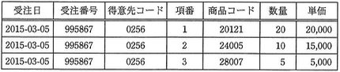
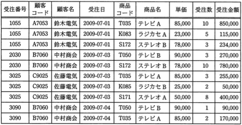

# データモデリング Lv6

----

**教材制作者へ**

このレベルには，IPA情報処理技術者試験の過去問を用いている。

該当の問題には出典を明記し，出典元と表現が大きく異ならないよう作成すること。

- [過去問題](https://www.jitec.ipa.go.jp/1_04hanni_sukiru/_index_mondai.html)

IPA情報処理技術者試験では，特に指示の無い場合は，ア〜エ（もしくはそれに順ずる英数記号）の単数選択問題とする。

 
 - 注意
 	- アンダーライン等がgithubで消えて見える場合があるので，その場合は過去問を直接確認してください。

----

## Q1

（出典：データベーススペシャリスト試験 平成27年春期分 午前Ⅱ 問4 をもとに作成）

UMLを用いて記述したデータモデルにおいて，"受講"クラスの属性として，適切なものはどれか。

- 学期名
- 科目名
- 氏名
- 成績

### ヒント1

各クラス名から，学校や教育機関のデータを扱うデータモデルだということが仮定できる。この前提で，各クラスに存在すべき属性か（主キーは何か）を考える。

### ヒント2

"氏名"は，学生ごとに定まる属性である。

したがって，学生の属性であることが望ましい。

"科目名"は，授業科目ごとに定まる属性である。

したがって，"授業科目"の属性であることが望ましい。

### ヒント3

"学期名"は，学期ごとに定まる属性である。

したがって，"学期"の属性であることが望ましい。

"成績"は，学生，学期，授業科目が定まることで一意に定まる属性である。

したがって，学生，学期，授業科目を主キーに持つ"受講"の属性であることが望ましい。

答え　成績

## Q2

（出典：データベーススペシャリスト試験 平成22年春期分 午前Ⅱ 問6 をもとに作成）

次の表を情報無損失分解したものはどれか。ここで，下線部は主キーを表す。

発注伝票(<u>注文番号</u>，<u>商品番号</u>，商品名，商品単価，注文数量)

ア　発注(<u>注文番号</u>，注文数量) 
　　商品(<u>商品番号</u>，商品名，商品単価)

イ　発注(<u>注文番号</u>，注文数量) 
　　商品(<u>商品番号</u>，<u>商品番号</u>，商品名，商品単価)

ウ　発注(<u>注文番号</u>，<u>商品番号</u>，注文数量) 
　　商品(<u>商品番号</u>，商品名，商品単価)

エ　発注(<u>注文番号</u>，<u>商品番号</u>，注文数量) 
　　商品(<u>商品番号</u>，商品名，商品単価，注文数量)

### ヒント1

情報無損失分解とは，正規化などで分割された表を自然結合することにより，分割前と全く同じ属性を復元できることをいう。

元表では，注文番号・商品番号を複合キーとしたものである。

### ヒント2

アは，"発注"表と"商品"表を自然結合を可能とするキー属性が存在しないため，元表を分割したものではない。

エは，自然結合した際に注文数量属性が複数となるため，元表と一致しない。

### ヒント3

イは，自然結合した際に，商品番号と注文数量の関連を参照することができない。

ウは，自然結合した際に，注文番号, 商品番号から注文数量，商品名，商品単価を参照できるようになっている。

答え　ウ

## Q3　ドロップダウン

（出典：データベーススペシャリスト試験 平成27年春期分 午前Ⅱ 問6 をもとに作成）

受注入力システムによって作成される次の表に関する記述のうち，適切なものはどれか。受注番号は受注ごとに新たに発行される番号であり，交番は1回の受注で商品コード別に連番で発行される番号である。

なお，単価は商品コードによって一意に定まる。

- 正規化は行われていない。
- 第1正規形まで正規化されている。
- 第2正規形まで正規化されている。
- 第3正規形まで正規化されている。

### ヒント1

第1正規形とは，非正規形の表に対し，属性の中に重複や繰り返しとなる項目が残らないように属性を分けたものである。

第2正規形とは，第1正規形の表に対し，主キー・複合キーによって，部分関数従属となる属性を，完全関数従属となるように表に分けたものである。

第3正規形とは，第2正規形の表に対し，主キー・複合キー以外の属性によって，推移的関数従属となる部分を完全関数従属となるように表に分けたものである。

### ヒント2

元表は，属性の中に重複や繰り返し項目となるものが含まれていない。そのため，第1正規化はおこなわれている。

### ヒント3

元表には，受注番号や商品コードといった候補キー属性があり，これらのキーもしくは複合キーによる完全関数従属となるようには分けられていない。したがって，第2正規化は行われていない。

こたえ　第1正規化まで正規化されている。

## Q4 ドロップダウン

（出典：データベーススペシャリスト試験 平成28年春期分 午前Ⅱ 問3 をもとに作成）

関係R（A,B,C）において，関数従属A→B, B→Cが成立するとき，**導けない関数従属**はどれか。

- {A,B,C}→{A,B}
- {A,C}→{A,B}
- {A,C}→{A,B,C}
- {B,C}→{A,C}

### ヒント1

関数従属とは，与えられた属性集合が他の属性を一意的に決定できることを意味する。

### ヒント2

設問より，AはAおよびBを，BはBおよびCを一意に決定できる。

{A,B,C} の属性集合が与えられた時は，AはA,Bを決定できる。よって{A,B,C}→{A,B}は成立する。

{A,C} の属性集合が与えられた時は，AがA,Bを決定できる。よって{A,C}→{A,B}は成立する。

### ヒント3

同様に，CはC自身を決定できる。よって，{A,C}→{A,B,C}は成立する。

{B,C} の属性集合が与えられた時は，Aを決定できる属性が存在しない。よって，{B,C}→{A,C}は導けない関数従属である。
　
答え　{B,C}→{A,C}

## Q5

（出典：データベーススペシャリスト試験 平成22年春期分 午前Ⅱ 問4 をもとに作成）

関係データベース上に実装するエンティティの主キーが複合キーであり，複合キーを構成している属性数が多すぎるので，少なくして扱いやすくしたい。この場合の対応として，適切なものはどれか。

ア　複合キーを構成している属性のうち，エンティティの性格を最もよく表している属性を主キーとし，残りの属性を外部キーにする。

イ　複合キーを構成している属性のうち，エンティティの性格を最もよく表している属性を主キーとし，残りの属性を代理キー（alternate key）にする。

ウ　複合キーを連番などの代用のキー（surrogate key）に置き換え，複合キーを構成している属性を外部キーにする。

エ　複合キーを連番などの代用のキー（surrogate key）に置き換え，複合キーを構成している属性を代理キー（alternate key）にする。

### ヒント1

主キーとは，表に格納されるデータ（属性の組み合わせ）を一意に識別できる識別子として用いることができる属性のことである。

複合キーとは，複数の属性の組み合わせを主キーとして用いることである。

代理キー（alternate key）とは，候補キーの中で主キー・複合キーとしていない属性のことである。

代用キー（surrogate key）とは，連番などの形で，主キー・複合キーの代用として用いることができる属性のことである。

### ヒント2

複合キーを用いている場合，複合キーの属性の一部だけでは，他の属性の組み合わせを一意に識別することはできない。

そのため，アおよびイは適していない。

### ヒント3

代用キーを用いることで，複合キーを用いなくても，属性の組み合わせの識別を行うことができる。

この時，複合キーは主キーではなくなるため，代理キーとなる。これにより，答えはエが適している。

答え　エ

## Q6　自由記述

（出典：データベーススペシャリスト試験 平成22年春期分 午前Ⅱ 問9 をもとに作成）

次の表を，第3正規形まで正規化を行なった場合，幾つの表に分割されるか。ここで，顧客の1回の注文に対して1枚の受注伝票が作られ，顧客は1回の注文で一つ以上の商品を注文できるものとする。

### ヒント1

第1正規形とは，非正規形の表に対し，属性の中に重複や繰り返しとなる項目が残らないように属性を分けたものである。

第2正規形とは，第1正規形の表に対し，主キー・複合キーによって，部分関数従属となる属性を，完全関数従属となるように表に分けたものである。

第3正規形とは，第2正規形の表に対し，主キー・複合キー以外の属性によって，推移的関数従属となる部分を完全関数従属となるように表に分けたものである。

元表には重複や繰り返しとなる項目が存在しておらず，第1正規形である。

### ヒント2

元表を第2正規形にするために，注文の情報を一意に定めることができる候補キーを検討する。

顧客の1回の注文に対して1枚の受注伝票が作られる，顧客は1回の注文で一つ　以上の商品を注文できることから，ある注文の情報は受注番号と商品コードを複合キーとすることで一意に定まる。

複合キーをもとに，部分関数従属となる属性が完全関数従属となるように表を分ける(下線は主キーを示す)。

1. 受注伝票（<u>受注番号</u>，<u>商品コード</u>，受注数，受注金額）
2. 受注情報（<u>受注番号</u>，顧客コード，顧客名，受注日）
3. 商品（<u>商品コード</u>，商品名，単価）

### ヒント3

3つの表を第三正規形にするために，推移的関数従属を検討する。

受注情報の顧客名は，顧客コードに推移的関数従属していると言えることから，これを別表に分ける(下線は主キーを示す)。

1. 受注伝票（<u>受注番号</u>，<u>商品コード</u>，受注数，受注金額）
2. 受注情報（<u>受注番号</u>，顧客コード，受注日）
3. 顧客（<u>顧客コード</u>, 顧客名）
4. 商品（<u>商品コード</u>，商品名，単価）

4つの表を自然結合することを考えると，情報無損失分解となっている。

したがって，答えは　4。

<!--

Lv6 応用情報技術者試験 平成28年度春期分 問27 正規化

Lv6 応用情報技術者試験 平成28年度春期分 問29 制約

Lv6 応用情報技術者試験 平成26年度秋期分 問26 多重度

Lv6 応用情報技術者試験 平成25年度秋期分 問45 多重度

Lv6 応用情報技術者試験 平成25年度春期分 問28 データモデル

-->
