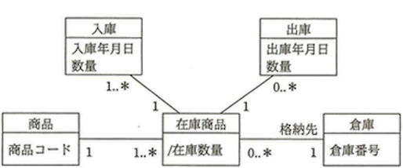
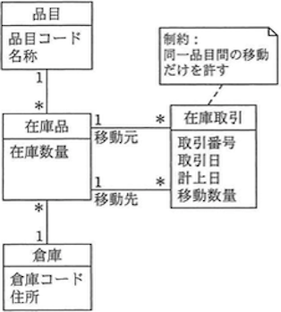

# データモデリング Lv7

----

**教材制作者へ**

このレベルには、IPA情報処理技術者試験の過去問を用いている。

該当の問題には出典を明記し、出典元と表現が大きく異ならないよう作成すること。

- [過去問題](https://www.jitec.ipa.go.jp/1_04hanni_sukiru/_index_mondai.html)

IPA情報処理技術者試験では、特に指示の無い場合は、ア〜エ（もしくはそれに順ずる英数記号）の単数選択問題とする。

----

## Q1 

（出典：データベーススペシャリスト試験 平成28年春期分 午前Ⅱ 問4 をもとに作成）

部，課，係の階層関係から成る組織のデータモデルとして，モデルA～Cの三つの案が提出された。これらに対する解釈として，適切なものはどれか。組織階層における組織の位置を組織レベルと呼ぶ。組織間の相対関係は，親子として記述している。ここで，モデルの表記にはUMLを用い，{階層}は組織の親と子の関連が循環しないことを指定する制約記述である。

ア　新しい組織レベルを設ける場合，どのモデルも変更する必要はない。

イ　どのモデルも，一つの子組織が複数の親組織から管轄される状況を記述できない。

ウ　モデルBを関係データベース上に実装する場合，子の組織コードを外部キーとする。

エ　モデルCでは，組織の親子関係が循環しないように制約を課す必要がある。

### ヒント1

モデルAでは、新たらしい組織レベル（例：部・課・係以外のもの。たとえば「チーム」や「プロジェクト」などが考えられる）が設けられた場合、対応することができない。

よってアは誤り。

### ヒント2

モデルAでは、係が部・課といった複数の親組織から管轄される状況を記述できる。

よってイは誤り。

### ヒント3

モデルBの多重度では、親に対して子側の多重度が\*で，子に対して親の多重度が0..\*で示されている。これは、親組織に対して、複数の子組織が存在することを示している。つまり、複数の子組織が親の組織コードを参照する必要性を示している。

この場合、外部キーとなるのは親となる組織のコードである。よってウは誤り。

モデルCは、組織が多対多の関係であることを示している。この場合、"部"の子組織が"課"であり、"課"の子組織が"部"であるといった循環関係を実現することができてしまう。

よってエが正しい。

答え　エ

## Q2

（出典：データベーススペシャリスト試験 平成28年春期分 午前Ⅱ 問6 をもとに作成）

四つの表の関係を表すE-R図として，適切なものはどれか。ここで，<u>1 \*</u>は1対多の関連を表し，実線の下線は主キーを，破線の下線は外部キーを表す。

### ヒント1

"医師"の診療科コードは，"診療科"の診療科コード（主キー）を参照する外部キーである。したがって，"医師"対"診療科"は多対1の関係である。

### ヒント2

"診察"の診療科コードは，"診療科"の診療科コード（主キー）を参照する外部キーである。したがって，"診察"対"診療科"は多対1の関係である。

### ヒント3

"診察"の患者番号は，"患者"の患者番号（主キー）を参照する外部キーである。したがって，"診察"対"患者"は多対1の関係である。

以上の条件を満たすものは，ウである。

こたえ　ウ

## Q3

（出典：データベーススペシャリスト試験 平成28年春期分 午前Ⅱ 問1 をもとに作成）

UMLを用いて表した商品と倉庫のデータモデルに関する記述のうち，適切なものはどれか。ここで，商品の倉庫間の移動はないものとする。

ア　1種類の商品を二つの倉庫に初めて入庫すると，"在庫商品"データが2件追加される。

イ　2種類の商品を一つの倉庫に入庫すると，"入庫"データが1件作成される。

ウ　格納先となる倉庫が確定していない商品が存在する。

エ　出庫の実績がない在庫商品は存在しない。

### ヒント1

"商品"対"在庫商品"は1:1〜多である。つまり"商品"1件には必ず1件以上の"商品在庫"が存在する。この前提で，"在庫商品"表と他の表の多重度から，正しい選択肢を選ぶ。

### ヒント2

"在庫商品"対"倉庫"は0〜多対1である。つまり"在庫商品"1件には必ず1件の"倉庫"が存在するため，ウは適切ではない。

"在庫商品"対"出庫"は1対0〜多である。つまり"在庫商品"1件には，"出庫"が0件（出庫がない）ことがありえるため，エは適切ではない。

### ヒント3

"在庫商品"対"入庫"は1対1〜多である。つまり"在庫商品"1件には，必ず1件以上の"入庫"が存在する。"商品"が2種類（つまり，2件）ある場合，"在庫商品"は2件以上になる。"在庫商品が"2件以上の時は，"入庫"も2件以上でなくてはならないため，イは適切ではない。

"商品"対"在庫商品"は1対1〜多，"在庫商品"対"倉庫"は1対0〜多である。
"商品"1件に対して"在庫商品"は複数件存在でき，"在庫商品"1件には"倉庫"が1件存在する。したがって，1種類の商品を二つの倉庫に初めて入庫するときは，"在庫商品"は2件である。

こたえ　ア

## Q4

（出典：データベーススペシャリスト試験 平成25年春期分 午前Ⅱ 問1 をもとに作成）

UMLを用いて表した図のデータモデルの解釈として，適切なものはどれか。

ア　1件の"在庫取引"データを記録する際，2件の"在庫品"データも更新する。

イ　"在庫品"データは，現在の在庫数量だけではく，過去の在庫数量も保持する。

ウ　倉庫別，品目別に入出庫の状況を把握することはできない。

エ　品目の異なる"在庫品"データ間で，"在庫取引"データを記録できる。

### ヒント1

このデータモデルは，多重度から，品目を倉庫と複合主キーとするある在庫品の在庫取引を記録するものであると判断できる。この前提に立って，表の情報から正しい選択肢を選ぶ。

### ヒント2

上記より，"品目"もしくは"倉庫"を指定することで，在庫品の移動取引を確認することができる。したがってウは適切ではない。

「同一品目間の移動だけを許す」という制約から，このデータモデルでは"品目"の異なる"在庫品"を移動することができない。したがってエは適切ではない。

### ヒント3

"在庫品"には，現在や過去といった在庫数量を定義できる属性はない。したがって，イは適切ではない。

"在庫品"対"在庫取引"は，移動元として1対多，移動先として1対多の関係である。つまり，在庫取引1件を記録するためには，移動先として1件，移動元として1件のあわせて2件の"在庫品"を更新する必要がある。したがって，アは適切である。

こたえ　ア

## Q5 

（出典：データベーススペシャリスト試験 平成28年春期分 午前Ⅱ 問5 をもとに作成）

関係データベースの表を設計する過程で，A表とB表が抽出された。主キーはそれぞれ列aと列bである。この二つの表の対応関係を実装する表の設計に関する記述のうち，適切なものはどれか。

ア　A表とB表の対応関係が1対1の場合，列aをB表に追加して外部キーとしてもよいし，列bをA表に追加して外部キーとしてもよい。

イ　A表とB表の対応関係が1対多の場合，列bをA表に追加して外部キーとする。

ウ　A表とB表の対応関係が多対多の場合，新しい表を作成し，その表に列aか列bのどちらかを外部キーとして設定する。

エ　A表とB表の対応関係が多対多の場合，列aをB表に，列bをA表にそれぞれ追加して外部キーとする。

### ヒント1

イを行なった場合，複数件のAに対し1件のBを表すことができる。A対Bは多対1となるので，適切ではない。

### ヒント2

多対多の関係を表すには，別表の中で，AおよびBの組み合わせを表す必要がある。つまり，別表の中では列aと列bの両方が外部キーとして必要となるので，適切ではない。

### ヒント3

エを行なった場合，1件のAに対して1件のB，1件のBに対して1件のAが表される。A対Bの関係は1対1となるので，適切ではない。

また，1対1の関係は，片方の表がもう片方の表のの主キーを外部キーとして設定されることにより成り立つ。したがって，アが適切である。

こたえ　ア

## Q6 

（出典：データベーススペシャリスト試験 平成24年春期分 午前Ⅱ 問5 をもとに作成）

関係Rは属性{A,B,C,D,E}から成り,関数従属性A→B，A→C，{C，D}→Eが成立する。最初に属性集合{A,B}を与えて，これらの関数従属性を適用して導出される属性をこの属性集合に加える。この操作を繰り返して得られる属性集合（属性集合の閉包）はどれか。

- {A,B,C}
- {A,B,C,D}
- {A,B,C,D,E}
- {A,B,E}

### ヒント1

関数従属性とは，与えられた属性集合が他の属性を一意的に決定できることを意味する。

### ヒント2

設問の関数従属性に対して，属性集合{A,B}が与えられた場合，A→B, A→Cの関数従属性から，{A,B,C}の属性集合が求められる。

### ヒント3

設問の関数従属性に属性集合{A,B,C}が与えられた場合も, A→B, A→Cの関数従属性から，{A,B,C}の属性が求められる。

このように，属性{A,B,C}の組み合わせから，新たな属性を得ることはできないため，繰り返して得られる属性集合は {A,B,C} が適切である。

こたえ {A,B,C}

## Q7

（出典：データベーススペシャリスト試験 平成24年春期分 午前Ⅱ 問8 をもとに作成）

第2正規形であるが第3正規形ではない表はどれか。ここで，講義名に対して担当教員名は一意に決まり，所属コードに対して勤務地は一意に決まるものとする。また，{　}は繰り返し項目を表し，実線の下線は主キーを表す。

### Hint1

第1正規形とは，非正規形の表に対し，属性の中に重複や繰り返しとなる項目が残らないように属性を分けたものである。

第2正規形とは，第1正規形の表に対し，主キー・連結キーによって，部分関数従属となる属性を，完全関数従属となるように表に分けたものである。

第3正規形とは，第2正規形の表に対し，主キー・連結キー以外の属性によって，推移的関数従属となる部分を完全関数従属となるように表に分けたものである。

### Hint2

アは，主キーである講義名から一意に決定できる担当教員名が，部分関数従属の属性であるため，第1正規形である。。

エは，趣味の中に繰り返し項目が存在するため，非正規形である。

### Hint3

イは，主キーによって完全関数従属となる属性のみ存在しているため，第3正規形である。

ウは，主キー以外である所属コードから一意に決定できる勤務地が，部分関数従属の属性であるため，第2正規形である。

こたえ　エ

<!--
## Q8 

Lv7 データベーススペシャリスト試験 平成22年春期分 午前Ⅱ 問7 正規化

Lv7 データベーススペシャリスト試験 平成21年春期分 午前Ⅱ 問4 データモデル

## Q10

次のE-R図(1)で示されるデータモデルを実装するために，図(2)のように連関エンティティ"所属"を用いて1対多の関連性に分解したい。このとき，図(2)の空欄に当てはまる多重度は何か。

[部活]0..3---0..*[部員]

[部活]1---0..*[所属]0..3---1[部員]

-->

