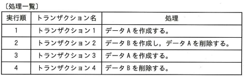
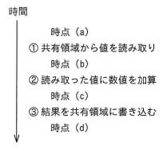
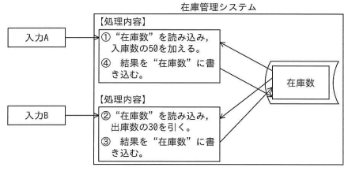
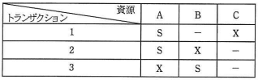

# データモデルとDBMS Lv6

----

**教材制作者へ**

このレベルには，ITパスポート試験，基本情報技術者試験の過去問を用いている。該当の問題には出典を明記し，出典元と表現が大きく異ならないよう作成すること。

- [ITパスポート試験 過去問題](https://www3.jitec.ipa.go.jp/JitesCbt/html/openinfo/questions.html)
- [基本情報技術者試験 過去問題](https://www.jitec.ipa.go.jp/1_04hanni_sukiru/_index_mondai.html)

----

## Q01

（出典：ITパスポート試験 平成23年度 秋期分 問63 をもとに作成）

複数の利用者が同一データベースに同時にアクセスする処理のうち，データの整合性を保つための対策が**不要**な処理はどれか。

ア オークションの入札処理 
イ オンラインショッピングの申込み処理 
ウ 図書情報の検索処理 
エ 列車座席の予約処理 

### ヒント1

複数の利用者やプロセスが同時にトランザクション処理を行い，データベースのデータ更新・変更を行うようなシステムでは，排他制御によってデータの整合性（データ構造やデータ同士の矛盾が発生しないこと）を保つ必要がある。

### ヒント2

アのシステムは，複数人が同時に同じ商品に入札する可能性がある。
イのシステムは，複数人が同時に同じ商品を購入する可能性がある。

### ヒント3

エのシステムは，複数人が同時に同じ席を予約する可能性がある。
ア〜エのようなシステムでは，入札や予約が重なってしまったり，在庫の数以上の商品購入がデータベースに反映されないよう，排他制御が必要になる。

ウのシステムは，複数人が同時に同じ商品を検索する可能性があるが，データの検索のみで，更新・変更を行うものではない。よって排他制御は不要となる。

答え　ウ

## Q02

（出典：ITパスポート試験 平成27年度 秋期分 問71 をもとに作成）

処理一覧に示す実行順に，トランザクション1〜4を実行する。あるトランザクションが途中で異常終了し，トランザクションを中断してロールバックした結果，データAとデータBが残った。異常終了したトランザクションはどれか。ここで，トランザクションが正常終了したときにコミットを行い，次のトランザクションがあればそれを実行する。異常終了したときは，当該トランザクション以降のトランザクションを実行しないものとする。

ア　トランザクション1 
イ　トランザクション2 
ウ　トランザクション3 
エ　トランザクション4

### ヒント1

トランザクション1が正常終了すると，データAが残る。

### ヒント2

トランザクション2が正常終了すると，データBが残る。

トランザクション3が正常終了すると，データAとデータBが残る。

### ヒント3

トランザクション4が正常終了すると，データBが残る。

異常終了したときに，事前のトランザクションの段階でデータAとデータBが残っているのはトランザクション4。

答え：エ

## Q03

（出典：ITパスポート試験 平成25年度 秋期分 問67 をもとに作成）

あるトランザクション処理は，①共有領域から値を読み取り，②読み取った値に数値を加算し，③結果を共有領域に書き込む手順からなっている。複数のトランザクションを並列に矛盾なく処理するためには，トランザクション処理のどの時点で共有領域をロックし，どの時点でロックを解除するのが適切か。

【1】共有領域のロック

 - 時点（a）
 - 時点（b）
 
【2】共有領域のロック解除

 - 時点（c）
 - 時点（d）

### ヒント1

①から③の操作がトランザクション処理として不可分である場合，①の時点での共有領域と③の時点の共有領域の状態は一貫して同じ（変更されていることがない）状態でなくてはならない。

### ヒント3

不可分な①から③の操作を，並列処理として処理α・βが同時に行うと仮定すると，共有領域は処理α，βの間で共有される。

### ヒント3

処理αが①から③の操作を正常終了する前に，処理βが先に共有領域に変更を行ってしまうと，処理αの①の段階と③の段階で共有領域の状態が異なり，一貫性が崩れる。

そのため，処理αが①から③を完了するまで，共有領域は他の処理の影響を受けないようロックされていなくてはならない。

これを満たすロックのタイミングは，①の前である時点(a)から，③の後である時点(d)である。

答え：【1】時点(a) 【2】時点(d)

## Q04

（出典：ITパスポート試験 平成24年度 秋期分 問80 をもとに作成）

ある在庫管理システムは，複数の入力を同時並行して処理し，在庫数を更新しているが，排他制御は行っていない。ある事典での在庫数が100であったとき，入力された二つの入力A，Bに応じて，図に示す処理が①→②→③→④の順序で実行された場合，処理④が終了した時点の在庫数はいくつになるか。

（自由記述）

### ヒント1

排他制御されていないため，在庫数はロックされない。

### ヒント2

そのため，

①の計算結果： 100 + 50 = 150

②の計算結果： 100 - 30 = 70

となる。

### ヒント3

③の処理により，在庫数には②の計算結果が書き込まれる。

④の処理により，在庫数には①の計算結果が書き込まれる。

答え：　150

## Q5

（出典：基本情報技術者試験 平成26年度 秋期分 問30 をもとに作成）

トランザクションの同時実行制御に用いられるロックの動作に関する記述のうち，適切なものはどれか。

ア　共有ロック獲得済の資源に対して，別のトランザクションからの新たな共有ロックの獲得を認める。 
イ　共有ロック獲得済の資源に対して，別のトランザクションからの新たな専有ロックの獲得を認める。 
ウ　専有ロック獲得済の資源に対して，別のトランザクションからの新たな共有ロックの獲得を認める。 
エ　専有ロック獲得済の資源に対して，別のトランザクションからの新たな専有ロックの獲得を認める。 

### ヒント1

排他制御などに用いられるロックには2種類のものが存在する。

共有ロックとは，データを読み込むときに用いられるロックである。

専有ロックとは，データを更新するときに用いられるロックである。

### ヒント2

あるトランザクションから専有ロックが行われた資源には，他のトランザクションからの更新（専有ロックを伴う）処理や読み込み（共有ロックを伴う）処理が一切行えなくなる。

### ヒント3

あるトランザクションから共有ロックが行われた資源には，他のトランザクションからの更新（専有ロックを伴う）の処理を行うことはできない。ただし，他のトランザクションからの読み込み（共有ロックを伴う）処理を行うことはできる。

答え：ア

## Q6

（出典：基本情報技術者試験 平成20年度 秋期分 問60 をもとに作成）

データベースの排他制御に関する記述のうち，適切なものはどれか。

ア　あるトランザクションによって共有ロックがかけられている資源に対して，別のトランザクションから共有ロックをかけることは可能である。 
イ　あるトランザクションによって共有ロックがかけられている資源に対して，別のトランザクションから占有ロックをかけることは可能である。 
ウ　あるトランザクションによって専有ロックがかけられている資源に対して，別のトランザクションから共有ロックをかけることは可能である。 
エ　あるトランザクションによって専有ロックがかけられている資源に対して，別のトランザクションから専有ロックをかけることは可能である。 

### ヒント1

排他制御などに用いられるロックには2種類のものが存在する。

共有ロックとは，データを読み込むときに用いられるロックである。

専有ロックとは，データを更新するときに用いられるロックである。

### ヒント2

あるトランザクションから専有ロックが行われた資源には，他のトランザクションからの更新（専有ロックを伴う）処理や読み込み（共有ロックを伴う）処理が一切行えなくなる。

### ヒント3

あるトランザクションから共有ロックが行われた資源には，他のトランザクションからの更新（専有ロックを伴う）の処理を行うことはできない。ただし，他のトランザクションからの読み込み（共有ロックを伴う）処理を行うことはできる。

答え：ア

## Q7

（出典：基本情報技術者試験 平成25年度 秋期分 問32 をもとに作成）

表は，トランザクション1～3が資源 A～C にかけるロックの種別を表す。また，資源へのロックはトランザクションの起動と同時にかけられる。トランザクション1～3のうち二つのトランザクションをほぼ同時に起動した場合の動きについて，適切な記述はどれか。ここで，表中の"－"はロックなし，"S"は共有ロック，"X"は専有ロックを示す。

ア　トランザクション1の後にトランザクション3を起動したとき，トランザクション3の資源待ちはない。 
イ　トランザクション2の後にトランザクション1を起動したとき，トランザクション1の資源待ちはない。 
ウ　トランザクション2の後にトランザクション3を起動したとき，トランザクション3の資源待ちはない。 
エ　トランザクション3の後にトランザクション1を起動したとき，トランザクション1の資源待ちはない。 

### ヒント1

排他制御などに用いられるロックには2種類のものが存在する。

共有ロックとは，データを読み込むときに用いられるロックである。

専有ロックとは，データを更新するときに用いられるロックである。

### ヒント2

あるトランザクションから専有ロックが行われた資源には，他のトランザクションからの更新（専有ロックを伴う）処理や読み込み（共有ロックを伴う）処理が一切行えなくなる。

あるトランザクションから共有ロックが行われた資源には，他のトランザクションからの更新（専有ロックを伴う）の処理を行うことはできない。ただし，他のトランザクションからの読み込み（共有ロックを伴う）処理を行うことはできる。

### ヒント3

- アは，トランザクション1の資源Aの共通ロック解除を待つ必要がある。
- ウは，トランザクション2の資源Aの共有ロックとBの専有ロックの解除を待つ必要がある。
- エは，トランザクション3の資源Aの専有ロックの解除を待つ必要がある。

答え　イ

## Q08

（出典：基本情報技術者試験 平成24年度 春期分 問32 をもとに作成）

DBMSにおけるログファイルの説明として，適切なものはどれか。

ア　システムダウンが発生したときにデータベースの回復処理時間を短縮するため，主記憶上の更新データを定期的にディスクに書き出したものである。 
イ ディスク障害があってもシステムをすぐに復旧させるため，常に同一データのコピーを別ディスクや別サイトのデータベースに書き出したものである。 
ウ ディスク障害からデータベースを回復するため，データベースの内容をディスク単位で複写したものである。 
エ　データベースの回復処理のため，データの更新前後の値を書き出してデータベースの更新記録を取ったものである。 

### ヒント1

チェックポイントとは，データベースの最終更新時点を表し，主記憶上の更新データを定期的にディスクに書き出したもの。

### ヒント2

バックアップとは，データベース障害などの対策として，データの複製（コピー）をディスク単位で別の媒体などに記録しておくこと。

### ヒント3

レプリケーションとは，データベースの内容を適宜別のデータベースへと書き出し，常に同一データのコピーを用意することで，ディスク障害があってもシステムをすぐに復旧させるための仕組み。

ログファイルとは，データベースのロールバック・ロールフォワード処理のために，データの更新前後の記録をとったもの。

答え　エ

## Q09

（出典：基本情報技術者試験 平成26年度 秋期分 問29 をもとに作成）

データベースのアクセス効率を低下させないために，定期的に実施する処理はどれか。

ア　再編成 
イ　データベースダンプ 
ウ　バックアップ 
エ　ロールバック 

### ヒント1

ロールバックとは，障害発生時に記録が完了していない操作結果を破棄し，最後に正常にデータが記録された時点（チェックポイント）の状態に復元すること。

### ヒント2

バックアップとは，データベース障害などの対策として，データの複製を別の媒体などに記録しておくこと。

### ヒント3

データベースダンプとは，データベースの内容を外部のファイルなどに書き出すこと。

再編成とは，データベースの追加や削除などで発生するデータ順の乱れを解消し，検索性やアクセス効率を向上させること。

答え　ア

## Q10

（出典：基本情報技術者試験 平成21年度 秋期分 問35 をもとに作成）

分散データベースの透過性の説明として，適切なものはどれか。

ア　クライアントのアプリケーションプログラムは，複数のサーバ上のデータベースをアクセスする。アプリケーションプログラムは，データベースがあたかも一つのサーバ上で稼働しているかのようにアクセスできる。 
ウ　複数のクライアントのアプリケーションプログラムが，一つのサーバ上のデータベースを共有してアクセスする。 
エ　複数のクライアントのアプリケーションプログラムは，一つのサーバ上のデータベースを，サーバ上のアプリケーションプログラムを介してアクセスする。 

### ヒント1

分散データベースとは，物理的に複数のコンピュータ上に展開されたデータベースを，論理的に接続して，ひとつのデータベースとして動作させるもの。

### ヒント2

分散データベースの透過性とは，ユーザやクライアントが，実際は分散データベース上で分割され管理されているデータを利用しているにも関わらず，まるでひとつのデータベースを利用しているように見せるための機能のこと。

### ヒント3

以上の条件に当てはまるものは，ア。

答え　ア

